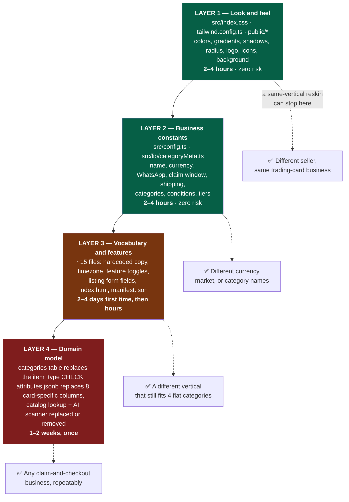
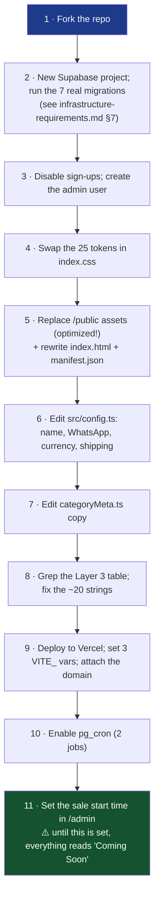
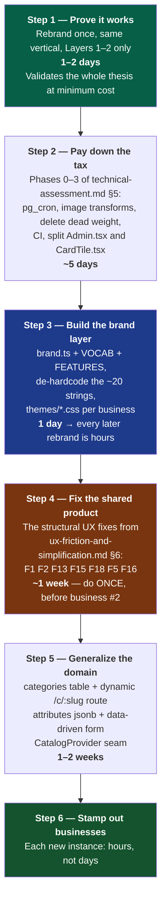

# Theming and White-Labeling Playbook

The operational answer to "what can we change cheaply?" Organised in four layers,
cheapest first, with exact files and line references.

## 0. The headline

**Layer 1 (look) is genuinely one CSS file plus `/public` assets. Layer 2
(business constants) is one 61-line TypeScript file. Together they are 80% of what
"a different business" visually means, and they are a day's work.**

Layers 3 and 4 are where the real cost sits — not because anything is badly built,
but because domain vocabulary is written into JSX and the Pokémon domain is baked
into one database constraint. **Doing Layer 3 properly once turns every subsequent
business from days into hours.** That is the single most important strategic
decision in this document.



---

## Layer 1 — Look and feel (2–4 hours)

### 1.1 The token block — `src/index.css`

Every color in the application resolves through these variables. **No component
hardcodes a color.** Change these 25 values and the app has a new identity.

| Token | Current (Pokémon dark) | What it controls |
|---|---|---|
| `--background` | `240 25% 7%` | Page background |
| `--foreground` | `0 0% 98%` | Body text |
| `--card` / `--card-foreground` | `240 22% 11%` / `0 0% 98%` | Tile and panel surfaces |
| `--popover` / `--popover-foreground` | same as card | Dialogs, sheets, selects |
| `--primary` | `48 96% 53%` (gold) | **Brand color** — claim buttons, prices, active states |
| `--primary-foreground` | `240 30% 10%` | Text on primary |
| `--primary-glow` | `48 100% 65%` | Glow accents |
| `--secondary` | `220 90% 56%` (blue) | Pre-order, shipping, informational |
| `--muted` / `--muted-foreground` | `240 15% 18%` / `240 5% 65%` | Secondary text and fills |
| `--accent` | `350 85% 55%` (red) | Discount badges, cart count |
| `--success` | `142 70% 45%` (green) | Stock, claims, checkout |
| `--destructive` | `0 84% 60%` | Out of stock, expiry |
| `--border` / `--input` / `--ring` | `240 15% 20%` / `240 15% 18%` / `48 96% 53%` | Chrome and focus |
| `--radius` | `0.875rem` | **Corner rounding everywhere** — the single biggest cheap lever on perceived style |

Plus the decorative layer:

| Token | Controls |
|---|---|
| `--gradient-hero` | Header wash (blue → purple → red) |
| `--gradient-gold` | Logo tiles, claim buttons, the primary CTA feel |
| `--gradient-card` | Tile background |
| `--shadow-glow` / `--shadow-card` / `--shadow-claim` | Depth and the claimed-state glow |
| `--gradient-slab-gold` / `--gradient-slab-holo` + their shadows | The two premium shimmer rings |

**All values must stay HSL** (space-separated, no `hsl()` wrapper) because
`tailwind.config.ts` wraps them as `hsl(var(--token))` and relies on that form for
opacity modifiers like `bg-primary/15`, which are used extensively.

### 1.2 Worked examples

Drop-in replacements for three different business feels. Each is the complete set
of changes for a new palette.

**Luxury watches / jewellery — deep navy + champagne**

```css
--background: 220 30% 8%;      --foreground: 40 20% 96%;
--card: 220 26% 12%;           --primary: 40 45% 68%;   /* champagne */
--primary-foreground: 220 40% 10%;
--secondary: 200 45% 45%;      --accent: 15 60% 52%;
--muted: 220 18% 18%;          --muted-foreground: 220 8% 62%;
--border: 220 18% 20%;         --ring: 40 45% 68%;
--radius: 0.375rem;            /* tighter corners read more formal */
--gradient-hero: linear-gradient(135deg, hsl(220 40% 22%), hsl(200 45% 30%) 60%, hsl(40 45% 45%));
--gradient-gold: linear-gradient(135deg, hsl(40 45% 68%), hsl(35 50% 58%));
```

**Sneakers / streetwear — light, high-contrast, energetic**

```css
--background: 0 0% 98%;        --foreground: 0 0% 8%;
--card: 0 0% 100%;             --primary: 15 90% 52%;   /* orange */
--primary-foreground: 0 0% 100%;
--secondary: 220 90% 50%;      --accent: 340 85% 50%;
--muted: 0 0% 94%;             --muted-foreground: 0 0% 38%;
--border: 0 0% 88%;            --ring: 15 90% 52%;
--radius: 1.25rem;             /* generous, playful */
```

⚠️ **A light theme also needs the `body` background rule rewritten** — it currently
layers two dark radial washes, a dark overlay, and `url('/bg-pattern.jpg')`. Replace
that whole block, don't just change the tokens.

**Plants / artisan goods — warm neutral + botanical green**

```css
--background: 40 20% 96%;      --foreground: 100 15% 12%;
--card: 0 0% 100%;             --primary: 145 45% 32%;
--primary-foreground: 0 0% 100%;
--secondary: 30 50% 48%;       --accent: 350 55% 48%;
--muted: 40 14% 90%;           --muted-foreground: 100 8% 40%;
--border: 40 14% 84%;          --ring: 145 45% 32%;
--radius: 1rem;
```

### 1.3 Animation and motion — `tailwind.config.ts`

Four custom keyframes carry the "live drop" energy: `pulse-glow` (the ring on
every claim button), `claim-pop` (the badge spring), `fade-in` (tile entrance),
`gradient-pan` (the shimmer). A calmer vertical should soften or drop
`pulse-glow` and `gradient-pan` — that alone changes the emotional register more
than any color.

**Do this regardless of vertical**, in `src/index.css`:

```css
@media (prefers-reduced-motion: reduce) {
  .animate-pulse-glow,
  .animate-gradient-pan,
  .animate-claim-pop,
  .animate-fade-in { animation: none !important; }
}
```

### 1.4 Assets — `/public` and `index.html`

| File | Current | Action |
|---|---|---|
| `yanks-tcg-logo.png` | **655 KB** ⚠️ | Replace **and optimize** — it renders at 32–56 px. Target ≤ 20 KB |
| `icon-192.png`, `icon-512.png` | 106 KB / **655 KB** ⚠️ | Replace and compress |
| `apple-touch-icon.png` | 95 KB | Replace |
| `favicon.ico` | — | Replace |
| `bg-pattern.jpg` | 167 KB, tiled 700px, `background-attachment: fixed` | Replace or remove. Fixed attachment costs scroll performance on mobile |
| `manifest.json` | `"Pokémon TCG Live Sale"`, `"TCG Sale"`, `"Claim Pokémon singles in real-time"`, `#0e0e1a` | Rewrite name, short_name, description, `background_color`, `theme_color` |
| `robots.txt` | — | Review |
| `index.html` | Title, description, `theme-color`, `og:*`, `twitter:*` (all mention "Yanks TCG" / "Pokémon"), `apple-mobile-web-app-title` | Rewrite every meta tag |

`AppLogo.tsx` hardcodes `src="/yanks-tcg-logo.png"` with a `Circle` icon fallback —
either keep the filename and swap the file, or make the path a config value (see
Layer 2).

---

## Layer 2 — Business constants (2–4 hours)

### 2.1 `src/config.ts` — 61 lines, already the right idea

| Constant | Current | Notes for adaptation |
|---|---|---|
| `SELLER_WHATSAPP` | `"918859744828"` | Digits only, no `+`. **The entire checkout depends on this** |
| `DEFAULT_COUNTRY_CODE` | `"91"` | Prefixed to buyer-entered phone numbers when building a `wa.me` link |
| `SELLER_NAME` | `"Yanks TCG"` | Appears in headers, the admin console title, the WhatsApp greeting, logo alt text |
| `CURRENCY` | `"₹"` | A **symbol only** — no locale formatting, no decimals (every price uses `.toFixed(0)`). For a currency with meaningful minor units this needs `Intl.NumberFormat` instead |
| `CLAIM_DURATION_MINUTES` | `10` | ⚠️ **Duplicated as `interval '10 minutes'` in two SQL functions.** Change both or the buyer's timer disagrees with the database |
| `FREE_SHIPPING_THRESHOLD` | `1500` | |
| `SHIPPING_FEE` | `150` | |
| `PREORDER_MIN_DAYS` / `MAX_DAYS` | `15` / `20` | Measured from the listing's `created_at`, not the order date |
| `CARD_CONDITIONS` | 5 TCG grades | Rename per vertical: watches → "Unworn / Excellent / Good / Fair"; sneakers → "Deadstock / VNDS / Used" |
| `ITEM_TYPES` | 4 entries | ⚠️ **Must match the SQL CHECK constraint on `cards.item_type`.** Two independent lists |
| `MAX_VIDEO_SIZE_BYTES` | 50 MB | Must match the Supabase project's upload limit |
| `GRADING_COMPANIES` | PSA/CGC/BGS/SGC/Other | 🔴 Trading-card-only. Generalizes as "certification body" for watches/coins/art; delete otherwise |
| `VISUAL_TIERS` | standard / top_grade / low_pop | 🟢 **The most portable premium idea in the codebase.** Rename to `standard` / `featured` / `rare` and it works for any vertical |

### 2.2 `src/lib/categoryMeta.ts` — the category system

One record keyed by `item_type`, each entry carrying `label`, `route`, `icon`
(lucide), `description`, `emptyMessage` and `noMatchMessage`, plus a
`CATEGORY_ORDER` array. The hub tiles and every category page header read from it.

Changing labels, icons, descriptions and empty-state copy is a **pure content
edit**. Changing the *set* of categories is not, because it requires:

1. a new key here,
2. a new value in `ITEM_TYPES` (`src/config.ts`),
3. a new value in the SQL CHECK constraint (a migration),
4. a new page file in `src/pages/`,
5. a new route in `src/App.tsx`.

Five coordinated edits across three languages. **That is the single biggest
structural friction in adapting this system, and Layer 4 fixes it.**

### 2.3 Recommended Layer 2 refactor — extract `brand.ts`

Small change, large payoff for the second and third business:

```ts
// src/brand.ts — everything a new business must edit, in one place
export const BRAND = {
  name: "Yanks TCG",
  tagline: "Live Sale",
  heroTitle: "Pokémon Cards",           // currently hardcoded at Index.tsx:150
  heroSubtitleLive: "Claim as many units as you want — first come, first served while stock lasts.",
  heroSubtitlePre: "Get ready! Preview the cards now, the live sale starts soon.",
  logoSrc: "/yanks-tcg-logo.png",       // currently hardcoded in AppLogo.tsx
  whatsappNumber: "918859744828",
  defaultCountryCode: "91",
  whatsappGroupUrl: "https://chat.whatsapp.com/…",  // currently hardcoded in PromoBar.tsx
  crossPromo: { label: "Yanks Diecast", url: "https://…" }, // or null
  timezone: "Asia/Kolkata",             // currently hardcoded in SaleTimeManager.tsx:14
  currency: { symbol: "₹", locale: "en-IN", code: "INR" },
} as const;

export const VOCAB = {
  buyer: "Trainer",                     // "Trainer:", "Top Trainers", "Anonymous Trainer"
  buyerPlural: "Trainers",
  points: "XP",                         // "1 XP per ₹1 spent"
  claimVerb: "Claim",
  claimVerbPreorder: "Order",
  item: "card",
  itemPlural: "cards",
} as const;

export const FEATURES = {
  boxBreaks: true,
  leaderboard: true,
  slabs: true,
  aiCardScanner: true,     // needs the Edge Function + a Gemini key
  catalogLookup: true,     // pokemontcg.io — Pokémon only
  preorders: true,
  vintageFlag: true,
  languageBadge: true,
  siteWideSale: true,
  usdConversion: true,     // fxRate.ts
} as const;
```

**Effort: half a day.** It converts Layer 3 from "hunt through 15 files" into
"edit two objects", and `FEATURES` lets you switch off whole sections rather than
delete code — so one codebase can serve several verticals.

---

## Layer 3 — Vocabulary and features (2–4 days first time)

### 3.1 The complete hardcoded-string inventory

Verified by grep. This is the full list — nothing else needs finding.

| File:line | String | Fix |
|---|---|---|
| `src/pages/Index.tsx:150` | `Pokémon Cards <span>Live Sale</span>` | `BRAND.heroTitle` + `BRAND.tagline` |
| `src/pages/Index.tsx:154-156` | Both hero sub-lines | `BRAND.heroSubtitle*` |
| `src/pages/Index.tsx:178` | `Trainer: {name}` | `VOCAB.buyer` |
| `src/pages/Index.tsx` | `Total Listed: ₹X` chip | Replace entirely (see [F7](../product/ux-friction-and-simplification.md)) |
| `src/pages/Index.tsx` | `Shop by category` | Config or keep |
| `src/pages/LiveBreak.tsx:196` | `Trainer: {name}` | `VOCAB.buyer` |
| `src/pages/Leaderboard.tsx:160` | `Trainer Leaderboard` | `VOCAB.buyer` |
| `src/pages/Leaderboard.tsx:162` | `1 XP per ₹1 spent` | `VOCAB.points` + currency |
| `src/pages/Leaderboard.tsx:199` | `Top Trainer Prize` | `VOCAB.buyer` |
| `src/pages/Leaderboard.tsx:238` | `{n} card{s}` | `VOCAB.item` |
| `src/pages/Leaderboard.tsx:248` | `Top Trainers` | `VOCAB.buyerPlural` |
| `src/pages/Leaderboard.tsx:288` | `XP` label | `VOCAB.points` |
| `src/components/SaleManager.tsx:203,267` | `XP awarded` | `VOCAB.points` |
| `src/components/NameGate.tsx:41-43` | Both explanatory copy blocks (mention XP and "claiming cards") | Config — and rewrite per [F1](../product/ux-friction-and-simplification.md) |
| `src/components/NameGate.tsx:75` | `Enter the Sale` | Config |
| `src/components/PromoBar.tsx:11-12` | `WHATSAPP_GROUP_LINK`, `HOT_WHEELS_SITE_URL` | `BRAND.whatsappGroupUrl`, `BRAND.crossPromo` |
| `src/components/SaleTimeManager.tsx:14` | `IST_TIMEZONE = 'Asia/Kolkata'` | `BRAND.timezone` — used at 5 call sites in this file |
| `src/components/AppLogo.tsx` | `src="/yanks-tcg-logo.png"` | `BRAND.logoSrc` |
| `src/lib/categoryMeta.ts` | All 4 labels + descriptions + empty-state copy | Content edit |
| `index.html` | Title, description, `theme-color`, 6 OG/Twitter tags, `apple-mobile-web-app-title` | Rewrite |
| `public/manifest.json` | name, short_name, description, colors | Rewrite |
| **SQL** — `get_monthly_leaderboard`, `get_sale_leaderboard` | `'Anonymous Trainer'` | Migration, or map it in the client |
| `src/pages/Admin.tsx` | Form placeholders: `Charizard ex`, `Obsidian Flames Booster Box`, `4/102`, `Rare Holo`, `Sleeves, Playmat, Binder...` | Per-category placeholder config |
| `src/pages/Admin.tsx` | `Search Pokémon TCG Database` label | Behind `FEATURES.catalogLookup` |

### 3.2 Features to gate rather than delete

Wrapping each in a `FEATURES` flag lets one codebase serve several verticals
without branching.

| Feature | Files | Gate or remove |
|---|---|---|
| **Box breaks** | `BoxBreaks.tsx`, `LiveBreak.tsx`, `LiveBreakChat.tsx`, `SlotGrid.tsx`, `BreakCheckoutSheet.tsx`, `LiveChat.tsx`, `BoxBreakManager.tsx`, 3 tables, 8 RPCs | **Gate.** Genuinely portable — "buy slot N of a live unboxing" works for mystery boxes, estate auctions, liquidation pallets, seed packs |
| **Leaderboard** | `Leaderboard.tsx`, 3 RPCs, prize fields in `app_settings` | **Gate.** Highly portable gamification |
| **Slabs / grading** | `item_type='slab'` branch in the admin form, badges in `CardTile`, 6 DB columns | **Gate.** Meaningful for anything with third-party certification (watches, coins, comics, sports memorabilia); noise otherwise |
| **AI card scanner** | `CardScanner.tsx`, `cardVision.ts`, the whole Edge Function | 🔴 **Pokémon-specific.** The *pattern* (photo → LLM → prefilled form) is extremely reusable — rewrite the prompt per vertical and it identifies sneakers, watches, books, plants. Highest-value thing to port, not to keep as-is |
| **Catalog lookup** | `pokemontcg.ts`, search UI in `Admin.tsx` | 🔴 Delete or replace with the vertical's catalog API (StockX, Discogs, ISBN, etc.) |
| **USD conversion** | `fxRate.ts` | **Gate.** Needed only when source prices are in a foreign currency |
| **Pre-orders** | `is_preorder`, arrival windows in `CardTile` and `CheckoutSheet` | **Gate.** Portable |
| **Vintage flag / language badge** | `is_vintage`, `language` on `cards` | 🟡 Fold into Layer 4's `attributes jsonb` |
| **Site-wide sale** | `SiteWideSaleManager.tsx`, 2 RPCs, 1 trigger | **Keep** — universally useful, though see [technical-assessment.md](../technical-assessment.md) §4 on simplifying the `pre_sale_price` mechanism |

### 3.3 A same-vertical rebrand, end to end

Different trading-card seller, same business model. This is the realistic
"customer number two":



**First time: 1–2 days.** After the `brand.ts` refactor: **2–4 hours.**

---

## Layer 4 — Domain model (1–2 weeks, once)

Only needed to serve a genuinely different vertical **repeatably**. Everything
here is described in schema terms in [data-model.md](../data-model.md) §7.

### 4.1 The one hard blocker — `item_type` is a CHECK constraint

```sql
CONSTRAINT cards_item_type_check CHECK (item_type IN ('card','sealed_product','accessory','slab'))
```

Adding a category today requires a migration, a TS union edit, a `categoryMeta`
entry, a new page and a new route. Replace it:

```sql
CREATE TABLE public.categories (
  slug        text PRIMARY KEY,
  label       text NOT NULL,
  description text,
  icon        text,                       -- lucide icon name, resolved client-side
  route       text NOT NULL,
  sort_order  integer NOT NULL DEFAULT 0,
  enabled     boolean NOT NULL DEFAULT true,
  field_schema jsonb NOT NULL DEFAULT '{}'::jsonb  -- drives the admin form
);

ALTER TABLE public.categories ENABLE ROW LEVEL SECURITY;
CREATE POLICY "Public can view categories" ON public.categories FOR SELECT USING (true);
CREATE POLICY "Authenticated can write categories" ON public.categories FOR ALL TO authenticated USING (true) WITH CHECK (true);

ALTER TABLE public.cards DROP CONSTRAINT cards_item_type_check;
ALTER TABLE public.cards
  ADD CONSTRAINT cards_item_type_fkey FOREIGN KEY (item_type) REFERENCES public.categories(slug);
```

Then make the category pages **one dynamic route** — `/c/:slug` — reading its
config from `categories` and reusing `useCategoryListing(slug)`. This replaces
four near-identical 200–270 line page files (`Singles`, `Slabs`, `Sealed`,
`Accessories`) with one, and makes adding a category a database row.

**Effort: 2–3 days.** Biggest structural win available for multi-business use, and
it also deletes ~600 lines of duplicated page code.

### 4.2 Eight Pokémon-specific columns → `attributes jsonb`

`card_set`, `card_number`, `rarity`, `language`, `grading_company`, `grade`,
`cert_number`, `population_count`/`population_note`, `slab_description` are dead
weight for any other vertical.

```sql
ALTER TABLE public.cards ADD COLUMN attributes jsonb NOT NULL DEFAULT '{}'::jsonb;
CREATE INDEX cards_attributes_idx ON public.cards USING gin (attributes);
-- backfill, then drop the old columns in a later migration
```

With `categories.field_schema` describing each category's fields (label, type,
required, options, filterable), the admin form and the filter row both become
**data-driven** — which is what finally kills the "20 conditionally-rendered
fields in a 1,318-line component" problem, rather than just relocating it.

**Effort: 3–5 days**, and it depends on R11 (splitting `Admin.tsx`) landing first.

### 4.3 The catalog-lookup and scanner seam

Define one interface and implement it per vertical:

```ts
// src/lib/catalog/types.ts
export interface CatalogProvider {
  search(query: string): Promise<CatalogMatch[]>;
  identifyFromImage?(dataUrl: string): Promise<CatalogMatch | null>;
}
export interface CatalogMatch {
  name: string;
  imageUrl?: string;
  priceUsd?: number;
  attributes: Record<string, string | number | null>;
}
```

`pokemontcg.ts` + `cardVision.ts` become `providers/pokemon.ts`; a business with
no catalog gets `providers/none.ts`. The Edge Function's prompt becomes
per-provider. **The scanner architecture is the most valuable transferable asset
here** — photo → LLM → prefilled listing solves the seller's real bottleneck in
*every* second-hand vertical, and the existing implementation already handles key
rotation, timeouts, structural citation of sources, and the suggest-vs-prefill
distinction correctly.

**Effort: 2–3 days** for the seam plus one new provider.

### 4.4 Also in Layer 4

| Change | Effort | Why |
|---|---|---|
| `CLAIM_DURATION_MINUTES` → `app_settings`, read by SQL and client | S | Kills the duplicated constant (R8) and becomes an admin-tunable lever |
| `transactions.status` + `shipping_fee` + `order_total` | M | Makes the ledger honest (R4); prerequisite for any payment integration |
| Rename `cards` → `listings` | S | Every future reader otherwise pays a confusion tax |
| `CURRENCY` symbol → `Intl.NumberFormat` | S | Required for any currency with meaningful minor units |
| `roles`/`profiles` table | M | Removes "any signup is an admin" (R2) |

---

## Vertical fit assessment

How well the existing model transfers, before any Layer 4 work:

| Vertical | Fit | Notes |
|---|---|---|
| **Other trading cards** (sports, Magic, One Piece) | 🟢 Excellent | Layers 1–2 only. Swap the catalog API |
| **Sneakers / streetwear** | 🟢 Very good | Drops, scarcity, hype, WhatsApp resale culture. Needs a size dimension — a real gap, since `quantity_available` is a single scalar |
| **Comics / manga / vinyl** | 🟢 Very good | Graded slabs → CGC comics maps directly; the grading fields are already right |
| **Watches / jewellery** | 🟢 Good | High consideration, so [F4](../product/ux-friction-and-simplification.md) (product page) becomes essential, not optional. Grading → certification |
| **Coins / stamps / bullion** | 🟢 Good | Grading and population counts map almost perfectly |
| **Mystery boxes / liquidation pallets** | 🟢 Excellent | The **box-break slot mechanic is a perfect fit** and is already built |
| **Art / prints** | 🟡 Moderate | Usually quantity 1; the leaderboard and race mechanic may be tonally wrong |
| **Plants / cuttings** | 🟡 Moderate | Drops and scarcity fit well; needs care info and seasonal availability |
| **Thrift / vintage clothing** | 🟡 Moderate | Fits the model; **needs sizes and measurements**, same gap as sneakers |
| **Perishables / food** | 🔴 Poor | Needs delivery windows, cold chain, and inventory expiry |
| **Services / bookings** | 🔴 Poor | Wrong primitive entirely — this is a stock reservation system, not a calendar |
| **Anything needing card payment at checkout** | 🔴 Poor | WhatsApp handoff is architectural, not a setting |

**The recurring gap worth naming**: `quantity_available` is a single integer per
listing. Any vertical with **variants** (shoe sizes, garment sizes, colourways)
needs a `variants` table with per-variant stock, and `claim_units` extended to
take a variant id. That's an additional **3–5 days** and it changes the core RPC —
plan for it explicitly if sneakers or clothing are on the roadmap.

---

## Recommended sequence



**Total to a repeatable multi-business platform: ~4–5 weeks of engineering.**
Compare with rebuilding from scratch — which would cost more, and would have to
re-derive the atomic claim logic, the RLS model, the realtime wiring and the
scanner epistemics that are already correct here.

### The one thing not to skip

**Step 4.** The temptation is to rebrand business #2 immediately after Step 1 and
skip both the tax payment and the product fixes. Doing that means every UX flaw in
[ux-friction-and-simplification.md](../product/ux-friction-and-simplification.md)
gets duplicated per business and has to be fixed N times, in N diverging forks.
Fix the shared product once, while there is still only one copy of it.
