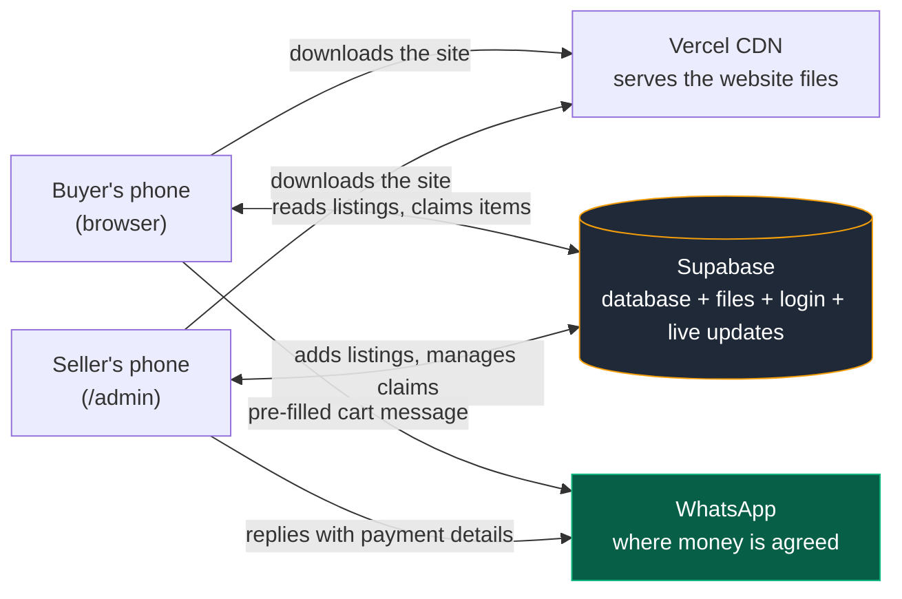
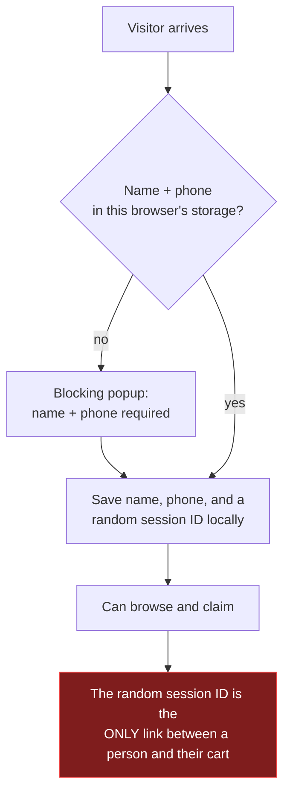
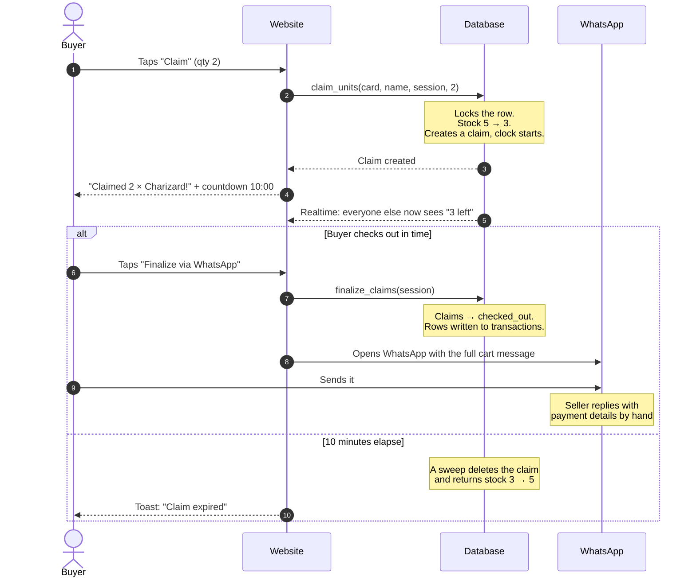
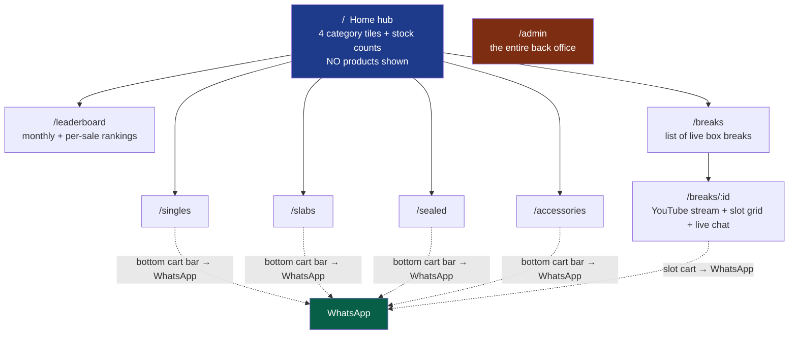
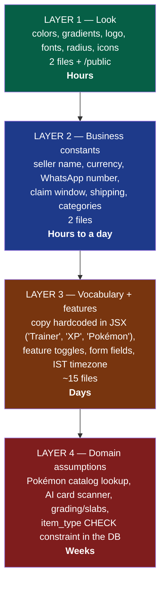

# System Architecture Explained for a Product Manager or Builder

No prior knowledge of the codebase assumed. If you only read one node in this
bundle, read this one, then jump to
[adaptation/theming-and-white-labeling.md](./adaptation/theming-and-white-labeling.md).

## 1. The one-paragraph version

There are only **three moving parts**. A **website** (plain files: HTML, JS,
images) that the visitor's browser downloads from a CDN. A **Supabase project**
(a hosted Postgres database with a REST API, file storage, login, and a live
push channel bolted on) that the browser talks to directly. And **WhatsApp**,
which is where the actual selling happens. There is no server of our own in the
middle. That is the single most important fact about this system: it explains
why it's cheap, why it's fast to change, and where its ceilings are.

## 2. What each part actually does

### The website (React SPA on Vercel)

A "single-page app": the browser downloads one bundle of JavaScript once, and
every subsequent screen is drawn locally without asking a server for a new page.

- **Cost**: effectively free. It's static files on a CDN.
- **Consequence**: the site is fast and cheap, but **invisible to search
  engines** for product content. Google sees an empty page and then JavaScript.
  If organic search traffic matters to a business you adapt this for, that's a
  real gap, not a setting to flip.
- **Consequence**: there are **11 screens total**, and no per-product page. A
  buyer cannot send a friend a link to one card. Everything is a grid tile that
  opens a popup.

### Supabase (the entire backend)

Supabase is a hosted bundle of five things this app uses:

| Supabase piece | What it does here | Plain-language analogy |
|---|---|---|
| Postgres database | Stores listings, claims, orders, chat, visits | The filing cabinet |
| PostgREST API | Lets the browser read tables over HTTPS | A window into the cabinet with a lock on it |
| Postgres functions (RPC) | **All the important rules live here** | The rulebook the cabinet enforces itself |
| Storage | Card photos, videos, prize images | The photo album |
| Realtime | Pushes changes to every open browser instantly | The tannoy announcement |
| Auth | The single admin login | One key, one keyholder |
| Edge Function | Calls Google Gemini to identify a scanned card | A hired specialist, called on demand |

**The unusual and important design choice**: the rules of the business are
written *inside the database*, in SQL, not in the website's code. When a buyer
claims a card, the browser doesn't do "read stock, subtract one, save" — it
calls a single database function named `claim_units` which locks that row,
checks stock, decrements it and records the claim in one indivisible step.

Why this matters to you as a PM: **two buyers tapping "Claim" on the last copy
at the same millisecond cannot both win.** That's genuinely hard to get right
and it's already right here. Any change that moves this logic into JavaScript
would break it. (Verified: `supabase/migrations/20260710000000_fresh_project_schema.sql`,
function `claim_units`, which uses `SELECT ... FOR UPDATE`.)

### WhatsApp (the checkout)

The "Finalize via WhatsApp" button does two things: it marks the buyer's claims
as checked out in the database, and it opens WhatsApp with a fully written
message listing every item, quantity, price, shipping and total. The seller then
replies with payment details by hand.

**This is the biggest product fact in the system.** It means:

- No payment gateway, no PCI concerns, no refunds logic, no failed-payment
  states. Enormous simplification.
- The `transactions` table records **intent, not payment**. It's written the
  moment the buyer taps the button, before any money exists. So "total sales" and
  the leaderboard's "XP" numbers are inflated by every abandoned WhatsApp
  conversation. (Verified: `finalize_claims` is called in the button's `onClick`
  in `src/components/CheckoutSheet.tsx:322`.)
- There is no order status, no "paid/shipped/delivered", and no way for a buyer
  to see their own past orders.

## 3. The two kinds of user, and how the system knows who they are

This is where most PM confusion lives, so it's worth being precise.

### Buyers have no account

When someone lands on the site, a popup asks for a **name and phone number**
before they can do anything (`src/components/NameGate.tsx`). Those two strings,
plus a **random ID generated in the browser**, are saved into that browser's
local storage. That random ID *is* the buyer's identity.

The consequences are worth internalizing:

- **Clear your browser data and your cart is gone**, unrecoverably. There is no
  account to log back into.
- **The same person on a phone and a laptop is two different people** to this
  system. Their leaderboard scores split.
- Nothing is verified. The name and phone are whatever was typed. There's no OTP.
- **The gate blocks browsing.** A first-time visitor cannot see a single product
  before surrendering a phone number. This is the single largest suspected
  conversion leak in the funnel — see
  [product/ux-friction-and-simplification.md](./product/ux-friction-and-simplification.md).

### The admin is one Supabase user

`/admin` shows a login form. There is no sign-up screen anywhere — the admin
account is created by hand in the Supabase dashboard. Once logged in, that
session can do everything: add/edit/delete listings, release or force-sell any
buyer's claim, start and end sales, apply a site-wide discount, run box breaks,
and read the visitor analytics.

**Risk to note**: the database's rule is literally "any logged-in user is an
admin". There are no roles. If sign-ups were ever switched on in the Supabase
dashboard, *every new signup would become a full administrator*. (Verified: RLS
policies grant to the `authenticated` role with `USING (true)`.)

## 4. The product's central mechanic: the claim

Everything about this product's feel comes from one idea — **a claim is a
10-minute reservation, not a purchase.**

**The catch a PM must know about**: the 10-minute expiry is not run by a
scheduled job. It runs when *someone's browser* asks the database to sweep —
every 30 seconds, from any open storefront tab, plus once inside every new claim.

> **If nobody has the site open, expired claims are never released and that
> stock stays invisible until the next visitor arrives.** (Verified:
> `src/hooks/useCategoryListing.ts` sweeps on a 30s interval; there is no cron
> job anywhere in the project.)

This is a small, cheap fix (a scheduled database job) and it is listed as the #1
technical priority in [technical-assessment.md](./technical-assessment.md).

## 5. The five screens buyers use, and the one the seller uses

Note that **the home page shows no products**. It's a navigation hub of four
tiles with stock counts. Every buyer must take an extra tap before seeing
anything for sale.

The `/admin` screen is a five-tab console: Listings, Box Breaks, Sales History,
Statistics, Sale Setup. It is one 1,318-line file — worth knowing because it
makes admin changes disproportionately slow and risky compared to everything
else in the codebase.

## 6. What "changing the theme for another business" really means

The honest answer is that there are **four layers**, and only the first two are
cheap. Full file-by-file detail is in
[adaptation/theming-and-white-labeling.md](./adaptation/theming-and-white-labeling.md);
this is the shape of it.

**Layer 1 is genuinely one file.** Every color in the app is defined as a CSS
variable in `src/index.css` — `--primary`, `--accent`, `--background` and so on,
plus a handful of gradients and glow shadows. Nothing in the app hardcodes a
color; components say "primary" and the variable decides what that is. Swap
those ~25 values and the entire app changes identity. That's an unusually clean
starting point and it's the main reason re-skinning rather than rebuilding is the
right call.

**Layer 2 is `src/config.ts`** — 61 lines holding seller name, WhatsApp number,
currency symbol, claim duration, free-shipping threshold, shipping fee,
pre-order window, condition list, listing types and visual tiers.

**Layer 3 is the annoying one.** Strings like `Pokémon Cards Live Sale`,
`Trainer:`, `Anonymous Trainer` (that one is inside SQL), `Claim as many units
as you want`, and the four category descriptions are written directly into
components rather than read from config. Individually trivial; collectively it's
the difference between a 2-hour rebrand and a 2-day one, and it's worth doing
*once* properly so the third and fourth business take hours.

**Layer 4 is where you decide what business you're actually in.** The AI card
scanner, the Pokémon TCG price lookup, the PSA/CGC grading fields and the
`item_type` list are baked to trading cards — including a database constraint
that only permits `card`, `slab`, `sealed_product`, `accessory`. Other
businesses (sneakers, watches, comics, art, plants, thrift) need that constraint
replaced by a real categories table.

## 7. What this system is good at, and what it is not

**Good at** — exactly one thing, done well: *a seller with scarce physical stock
running a time-boxed drop where the fun is in racing other buyers, and where
payment is a relationship rather than a transaction.* The realtime stock counts,
the claim countdown, the leaderboard XP, the live box-break chat and the shimmer
rings on rare items are all serving that one job, and they're coherent.

**Not good at**:

| Want | Reality |
|---|---|
| Take card payments online | Doesn't exist. Weeks of work + a payment provider. |
| Buyers see their order history | No accounts, so nothing to show. |
| Be found on Google | SPA with no product pages; effectively unindexable. |
| Sell 5,000 SKUs | Every page loads the entire category at once, unpaginated. Fine at ~200 rows, degrades hard past a few thousand. |
| Always-open store | The whole catalog is browse-only until a `sale_start_time` is set; buttons read "Coming Soon". |
| Run several businesses off one deployment | Single-tenant by design. Each business = its own Supabase project + Vercel deploy. |
| Know real revenue | The transactions table counts WhatsApp button taps, not payments. |

## 8. The five numbers to keep an eye on

1. **Supabase egress (bandwidth)** — the binding constraint, and it has already
   been hit once. Card videos autoplaying in the grid blew the quota, which is
   why videos now only play on an explicit tap (see the comment at
   `src/components/CardTile.tsx:444`). Images are served full-size with no
   resizing.
2. **Realtime connections during a drop** — every open tab opens 2–3 live
   channels, and they're subscribed to *whole tables*, not filtered rows. 500
   concurrent viewers is the zone to load-test before trusting it.
3. **Storage size** — full-resolution photos plus up to 50 MB videos per
   listing.
4. **Gemini free-tier rate limits** — the AI scanner is ~20 requests/minute per
   API key. The code already supports rotating several keys because this was hit
   in practice.
5. **Claims stuck in limbo** — a direct consequence of the missing scheduled
   sweep. Watch for stock that looks lower than the shelf.

## 9. Where to go next

- If you're about to brief an engineer on a rebrand →
  [adaptation/theming-and-white-labeling.md](./adaptation/theming-and-white-labeling.md)
- If you're deciding what to fix first →
  [technical-assessment.md](./technical-assessment.md) §5 (ranked plan)
- If you're redesigning the funnel →
  [product/ux-current-state.md](./product/ux-current-state.md) then
  [product/ux-friction-and-simplification.md](./product/ux-friction-and-simplification.md)
- If you need to budget hosting →
  [infrastructure-requirements.md](./infrastructure-requirements.md) §6
