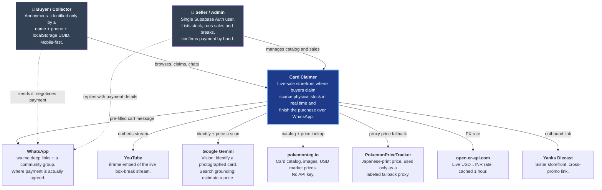
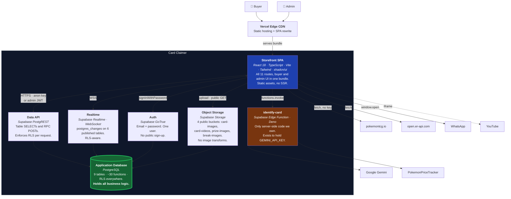
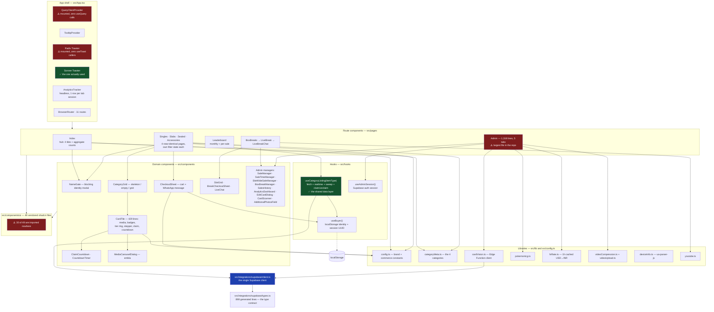
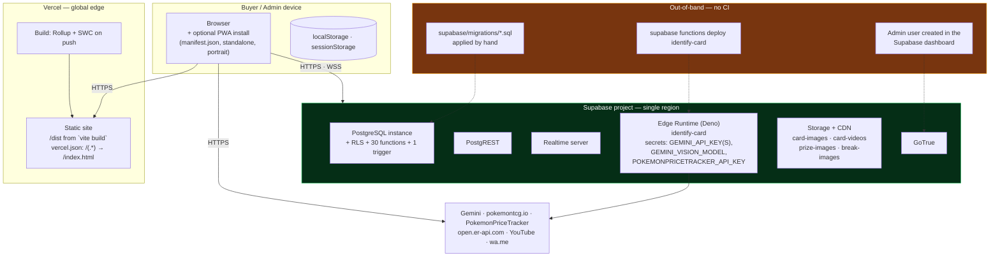

# C4 Model

Four levels, following Simon Brown's C4: **Context** (who uses it and what it
talks to), **Container** (the deployable/runnable pieces), **Component** (the
internals of the two significant containers), and **Deployment** (where it all
physically runs). Mermaid is used rather than the C4-DSL so these render in
GitHub, Notion and Obsidian without tooling.

---

## Level 1 — System Context

**The defining boundary**: money is *outside* the system. Card Claimer's job ends
at generating a WhatsApp message. Everything about the data model, the 10-minute
claim TTL and the meaning of the `transactions` table follows from that.

---

## Level 2 — Containers

### Container responsibilities

| Container | Technology | Owns | Explicitly does **not** own |
|---|---|---|---|
| Storefront SPA | React 18.3, TS 5.8, Vite 5, Tailwind 3.4, shadcn/ui | All rendering, filter/sort/search, cart display, countdown timers, WhatsApp message composition, realtime subscription wiring, client-side video compression | Stock arithmetic, price authority, order creation, expiry enforcement |
| Data API (PostgREST) | Supabase-managed | Row-level authorization on every request, RPC dispatch | Any business rule of its own |
| Application Database | PostgreSQL | **Stock decrement, claim TTL, order finalization, site-wide discounts, leaderboard aggregation, slot uniqueness, analytics aggregation** | Presentation, notifications, scheduling |
| Realtime | Supabase-managed | Change fan-out to open tabs | Delivery guarantees the app relies on (all reads have an explicit fetch path) |
| Auth | GoTrue | Admin session, JWT refresh | Buyer identity — buyers have no account |
| Object Storage | Supabase Storage | Serving media at original resolution | Resizing, watermarking, CDN transforms |
| identify-card | Deno on Supabase Edge | Holding the Gemini key, key rotation on rate limits, 20 s timeouts, grounded price search, JP proxy fallback | Writing anything to the database |

---

## Level 3a — Components of the Storefront SPA

### What this diagram tells you about changing the app

- **`useCategoryListing` is the good abstraction.** Four category pages share one
  data layer (fetch + realtime + sweep + claim/unclaim); each page keeps only its
  own filter UI, because the facets genuinely differ. Adding a fifth category is
  a new 200-line page reusing this hook, not new plumbing.
- **`CardTile` (429 lines) and `Admin` (1,318 lines) are the two hotspots.** Any
  visual redesign hits `CardTile`; any workflow change hits `Admin`. Both are
  where a re-skin will actually cost time.
- **`config.ts` + `categoryMeta.ts` + `index.css` form the de-facto brand layer**,
  which is why re-theming is cheap. See
  [adaptation/theming-and-white-labeling.md](./adaptation/theming-and-white-labeling.md).
- **Three components marked red are pure removable weight**: an unused query
  cache, a second unused toast system, and 30 unused vendored UI files.

---

## Level 3b — Components of the Application Database

The database is the real backend, so it gets a component diagram of its own.

```mermaid
flowchart TB
  subgraph public_iface["Public surface — granted to anon"]
    p1["claim_units<br/><i>row lock, stock decrement, claim insert</i>"]
    p2["release_claim<br/><i>session-scoped, returns stock</i>"]
    p3["finalize_claims<br/><i>claims → checked_out, writes transactions</i>"]
    p4["get_my_claims<br/><i>SECURITY DEFINER read-around for RLS</i>"]
    p5["release_expired_claims<br/><i>the TTL sweep</i>"]
    p6["claim_break_slots · release_break_slot_claim<br/>finalize_break_slot_claims<br/>release_expired_break_slot_claims"]
    p7["list_sales · get_monthly_leaderboard<br/>get_sale_leaderboard"]
  end

  subgraph admin_iface["Admin surface — authenticated only, revoked from PUBLIC + anon"]
    a1["start_sale · end_active_sale · update_sale_prize"]
    a2["mark_claim_as_sold · admin_release_claim"]
    a3["apply_site_wide_sale · end_site_wide_sale"]
    a4["admin_mark_break_slot_sold<br/>admin_release_break_slot_claim"]
    a5["7 analytics RPCs:<br/>get_visitor_overview · get_device_breakdown<br/>get_browser_breakdown · get_os_breakdown<br/>get_daily_visits · get_top_entry_pages<br/>get_referrer_breakdown"]
  end

  subgraph tables["Tables — RLS enabled on all"]
    t_cards[("cards<br/>catalog + denormalized stock")]
    t_claims[("claims<br/>ephemeral cart, 10-min TTL<br/>🔒 no public SELECT")]
    t_sales[("sales<br/>one active enforced by partial unique index")]
    t_tx[("transactions<br/>append-only ledger, order_id groups a checkout")]
    t_set[("app_settings<br/>singleton id = 1")]
    t_bb[("box_breaks")]
    t_bsc[("break_slot_claims<br/>UNIQUE(break_id, slot_number)")]
    t_chat[("live_chat_messages<br/>public INSERT")]
    t_sv[("site_visits<br/>🔒 admin SELECT, public INSERT +<br/>column-grant UPDATE(last_seen_at)")]
  end

  subgraph triggers["Triggers"]
    tr1["trg_new_card_site_wide_sale<br/>BEFORE INSERT ON cards<br/><i>backs up sale_price and applies the live<br/>discount to a card added mid-sale</i>"]
  end

  subgraph realtime["Realtime publication"]
    rtp["<b>Published (7):</b> cards · claims · app_settings · transactions<br/>box_breaks · break_slot_claims · live_chat_messages<br/><br/>site_visits has REPLICA IDENTITY FULL but was<br/>never added to the publication — no fan-out<br/><br/>all 8 are REPLICA IDENTITY FULL"]
  end

  p1 --> t_cards & t_claims
  p2 --> t_cards & t_claims
  p3 --> t_claims & t_tx
  p4 --> t_claims
  p5 --> t_cards & t_claims
  p6 --> t_bsc & t_bb
  p7 --> t_sales & t_tx
  a1 --> t_sales
  a2 --> t_claims & t_tx & t_cards
  a3 --> t_cards & t_set
  a4 --> t_bsc
  a5 --> t_sv
  tr1 --> t_cards
  tables --> rtp

  style t_claims fill:#7f1d1d,color:#fff
  style t_sv fill:#7f1d1d,color:#fff
  style admin_iface fill:#14532d,color:#fff
  style public_iface fill:#1e3a8a,color:#fff
```

**The pattern to preserve**: buyers never touch a table directly for anything
that matters. `claims` and `site_visits` are readable only through
`SECURITY DEFINER` functions or an admin session, which is what keeps buyer phone
numbers and traffic data off the public API.

---

## Level 4 — Deployment

### Deployment facts

| Aspect | State |
|---|---|
| Environments | **One.** No staging project, no preview database. Vercel preview builds would point at production Supabase. |
| Frontend CI/CD | Vercel on push. No lint/typecheck/test gate (`.github/workflows` does not exist). |
| Database CD | **Manual.** Migrations applied by hand; 12 of 20 files are legacy or untimestamped, so the folder is not a replayable history. |
| Edge Function CD | **Manual** — `supabase functions deploy identify-card --project-ref govervcxumkbpmnnotpr`. |
| Secrets | 3 public `VITE_*` vars in Vercel (and committed to `.env` in the repo — publishable keys, so not a leak, but a bad default); 3 server secrets in Supabase Edge config. |
| Scheduled jobs | **None.** See [system-architecture.md](./system-architecture.md) §9. |
| Regions | Whatever region the Supabase project was created in; the CDN is global but every API call is single-region. For an India-focused audience (INR, IST, Indian phone defaults) confirm the project sits in `ap-south-1`. *Assumption — verify in the dashboard.* |
| Backups | Supabase plan default only. No application-level export of `transactions`. |

---

## Cross-level traceability

| C4 element | Source of truth |
|---|---|
| Storefront SPA | `src/` (59 app files + 49 vendored UI files) |
| Route list | `src/App.tsx:26-40` |
| Shared listing data layer | `src/hooks/useCategoryListing.ts` |
| Buyer identity | `src/hooks/useBuyer.ts` |
| Brand + commerce config | `src/config.ts`, `src/lib/categoryMeta.ts`, `src/index.css` |
| Public + admin RPC surface | `supabase/migrations/20260710000000_fresh_project_schema.sql`, `20260727000000_box_breaks.sql`, `20260728030000_site_visits_analytics.sql` |
| Realtime publication | same migrations, `ALTER PUBLICATION supabase_realtime ADD TABLE` |
| Storage buckets + policies | same migrations, `INSERT INTO storage.buckets` |
| Edge Function | `supabase/functions/identify-card/index.ts` |
| Static hosting rewrite | `vercel.json` |
