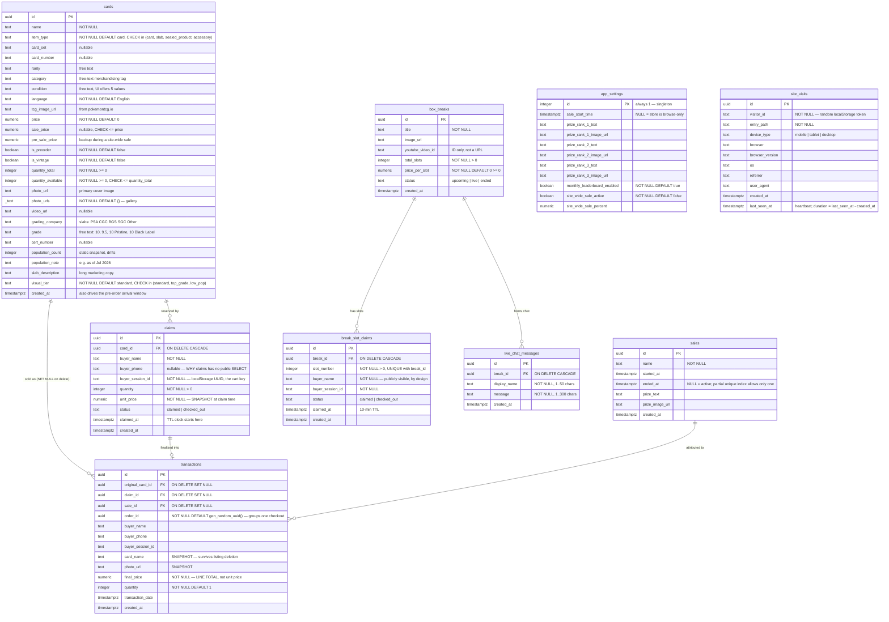
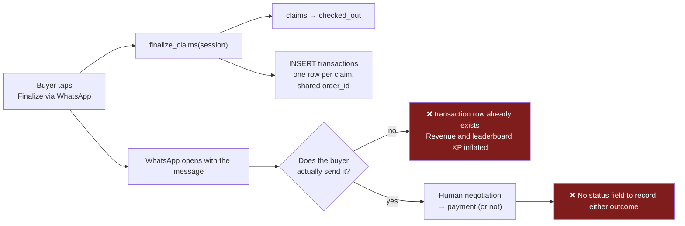
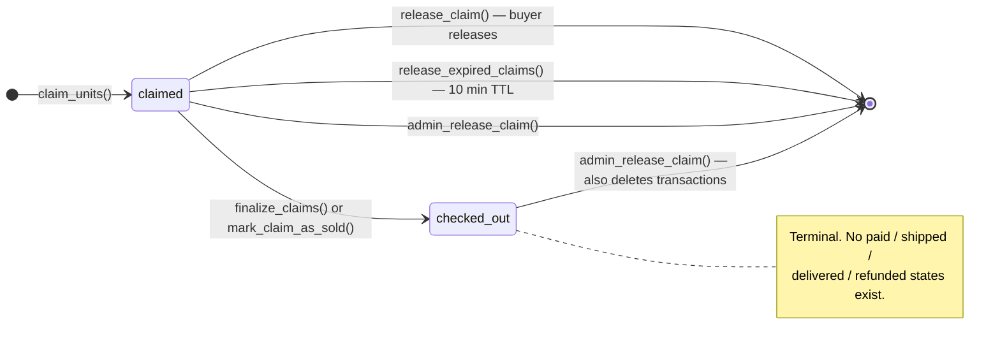
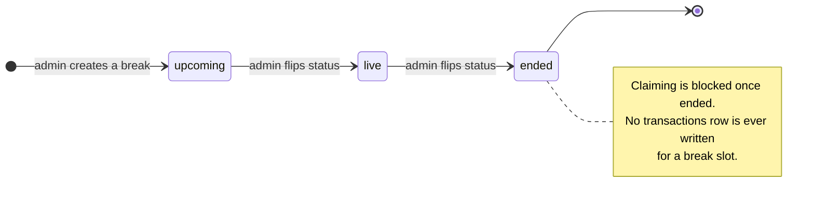
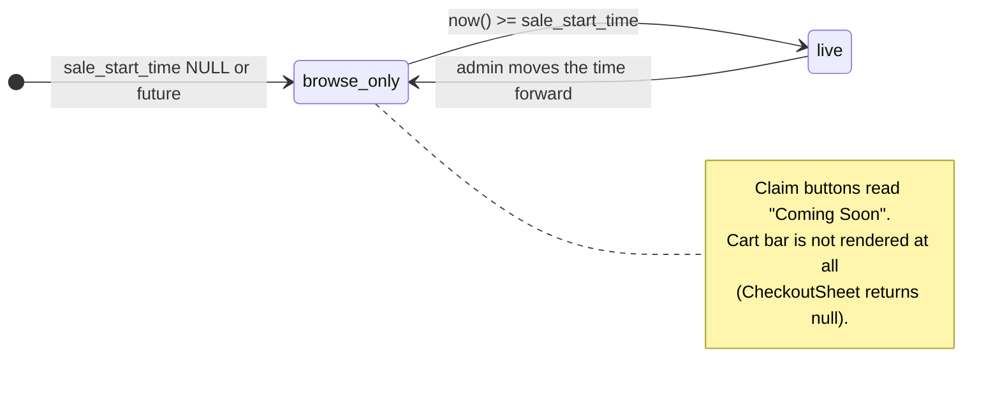

# Data Model

9 tables, ~30 functions, 1 trigger, RLS on everything. This node is the
reference; [system-architecture.md](./system-architecture.md) explains why it's
shaped this way.

## 1. Entity relationship diagram



`site_visits` is deliberately unrelated to every other table — it stores no
name, email, phone or IP, so it cannot be joined to a buyer. That's what lets it
run without a cookie banner (*inferred from the migration's stated intent; not
legal advice*).

## 2. Table-by-table notes

### 2.1 `cards` — one table, four product shapes

`item_type` is a **single-table-inheritance discriminator**. Which columns are
meaningful depends on it:

| Column group | `card` | `slab` | `sealed_product` | `accessory` |
|---|---|---|---|---|
| name, price, sale_price, quantity, photos, video, condition, language | ✅ | ✅ | ✅ | ✅ |
| card_set, card_number, rarity, tcg_image_url | ✅ | ✅ | — | — |
| grading_company, grade, cert_number, population_count, population_note, slab_description | — | ✅ | — | — |
| category (free-text merchandising tag) | ✅ | ✅ | ✅ | ✅ |
| visual_tier | ✅ any listing type | ✅ | ✅ | ✅ |

Nothing in the database enforces this shape — a `sealed_product` row can carry a
PSA grade. The rules live only in the admin form's conditional rendering
(`src/pages/Admin.tsx`). *Verified.*

Three design decisions worth understanding before you change anything:

- **`quantity_available` is a denormalized counter**, not a computed value. It is
  the single source of truth for "in stock" and is mutated only by RPCs. Any code
  path that decrements it outside a function is a bug waiting to happen.
- **`visual_tier` drives the shimmer ring** (`standard` / `top_grade` gold /
  `low_pop` holo) and is **set editorially by the admin**, not derived. Migration
  `20260728020000` backfilled it from ~30 hand-listed exact rarity strings, using
  exact match rather than `ILIKE` because substrings collide (`"Rare (Poke Ball
  Pattern)"` deserves a ring, `"Uncommon (Poke Ball Pattern)"` does not). That
  migration is a good record of how messy the free-text `rarity` column is.
- **`created_at` is load-bearing for pricing**, not just ordering: the pre-order
  arrival window is `created_at + 15..20 days`, so it is derived from the
  *publish* date, never the order date. A buyer ordering a 3-week-old pre-order
  listing sees an arrival window already in the past. *Verified —
  `src/components/CardTile.tsx:540` and `CheckoutSheet.tsx:121`.*

**Free-text columns with no lookup table**: `card_set`, `card_number`, `rarity`,
`category`, `condition`, `language`, `grading_company`, `grade`. Filter facets on
each category page are built by `Array.from(new Set(...))` over whatever is
currently loaded, so a typo becomes a permanent filter option. `ComboSelect` in
the admin form mitigates this by offering existing values, but does not enforce
them.

### 2.2 `claims` — a server-side cart with a TTL

This is the most conceptually distinctive table in the schema. It is
simultaneously the cart, the stock reservation and the pre-order record.

- Keyed by `buyer_session_id` — a random UUID in the buyer's `localStorage`. No
  foreign key to any user, because there are no users.
- `unit_price` is snapshotted as `COALESCE(sale_price, price)` at claim time.
- `status` only ever moves `claimed → checked_out`. There is no `paid`,
  `shipped`, `cancelled` or `refunded`.
- Rows in `claimed` status older than 10 minutes are **deleted** by the sweep,
  not soft-deleted, so an expired claim leaves no trace.
- **No public SELECT policy** — this is the deliberate protection around
  `buyer_phone`. Buyers read only their own via `get_my_claims(session_id)`.

### 2.3 `transactions` — an intent ledger, not a payment ledger



Other facts:

- `final_price` is the **line total** (`quantity × unit_price`), not a unit price.
  Summing it gives gross merchandise intent.
- **Shipping is never persisted.** `FREE_SHIPPING_THRESHOLD` and `SHIPPING_FEE`
  are applied only when composing the WhatsApp text and the cart totals; the
  database has no shipping column, so a reconstructed order total from
  `transactions` will not match what the buyer was shown.
- `order_id` groups the line items of a single checkout. `mark_claim_as_sold`
  (admin path) generates a **fresh** `order_id` per claim, so admin-marked sales
  never group. *Verified.*
- `ON DELETE SET NULL` on all three FKs plus the `card_name`/`photo_url`
  snapshots means history survives catalog deletion. Good design.

### 2.4 `sales` — the "episode" concept

A `sale` is a named live-selling session with an optional prize. `ended_at IS
NULL` means active, and

```sql
CREATE UNIQUE INDEX sales_one_active_idx ON public.sales ((1)) WHERE ended_at IS NULL;
```

is an elegant way to enforce **at most one active sale** at the database level —
a partial unique index on a constant expression. `start_sale()` ends the current
one before opening a new one, so the constraint should never actually fire.

Note the distinction from `app_settings.sale_start_time`: a `sales` row is an
attribution bucket for the leaderboard, while `sale_start_time` is the *gate* that
makes claim buttons live. **They are independent** — you can have a live
storefront with no active `sales` row (in which case `finalize_claims` writes
transactions with `sale_id = NULL` and they appear in no per-sale leaderboard).
This is a genuine footgun. *Verified.*

### 2.5 `app_settings` — a singleton with a mixed remit

One row, `id = 1`, inserted by the migration. Holds the sale gate, three ranks of
monthly prize copy/images, a leaderboard on/off flag, and the site-wide sale
state. It's published to Realtime so all clients react to a change immediately —
which is how "the sale just went live" propagates without a refresh.

Being a singleton with `Public can view app_settings` means **every setting here
is public**. Don't add anything private to this table.

### 2.6 `break_slot_claims` — deliberately public

Unlike `claims`, this table has `Public can view slot claims` — because seeing
whose name is on which slot in real time *is* the box-break product. It's safe
precisely because it carries **no phone number**. If you ever add contact details
to this table, that policy must change with it. The migration says so explicitly.

### 2.7 `site_visits` — self-hosted analytics

One row per **browser-tab session**, not per pageview: inserted on load,
`last_seen_at` touched every 20 s while the tab is visible. Duration is derived
on read rather than captured at unload, because `beforeunload`/`sendBeacon` are
unreliable on mobile.

The permission model here is the most surgical in the schema:

```sql
CREATE POLICY "Public can heartbeat visits" ON public.site_visits FOR UPDATE USING (true) WITH CHECK (true);
REVOKE UPDATE ON public.site_visits FROM anon, authenticated;
GRANT UPDATE (last_seen_at) ON public.site_visits TO anon, authenticated;
```

A **column-level grant** restricts anon UPDATE to `last_seen_at` alone, so the
permissive row policy can't be abused to rewrite a visit's device or referrer.
The worst an attacker can do is bump someone else's timestamp.

## 3. Constraint inventory

| Constraint | Table | Guards against |
|---|---|---|
| `chk_sale_price_less_than_price` | cards | a "discount" above list price |
| `chk_available_within_total` | cards | available > total |
| `quantity_total >= 0`, `quantity_available >= 0` | cards | negative stock |
| `cards_item_type_check` | cards | unknown listing type — **the main obstacle to a non-card business** |
| `chk_cards_visual_tier` | cards | unknown tile treatment |
| `quantity > 0` | claims | zero/negative claims |
| `status IN ('claimed','checked_out')` | claims, break_slot_claims | invalid state |
| `sales_one_active_idx` (partial unique) | sales | two concurrent sales |
| `uq_break_slot UNIQUE(break_id, slot_number)` | break_slot_claims | **double-claiming a slot — the race guard** |
| `total_slots > 0`, `price_per_slot >= 0` | box_breaks | nonsense breaks |
| `char_length` 1..50 / 1..300 | live_chat_messages | empty or essay-length chat |

Indexes: `cards(sale_price)`, `cards(category)`, `cards(is_slab)` (**now
vestigial — the column was dropped in `20260728010000` but the index creation
predates it in a separate migration**), `claims(card_id)`, `claims(buyer_session_id)`,
`transactions(sale_id)`, `transactions(order_id)`, `break_slot_claims(break_id)`,
`break_slot_claims(buyer_session_id)`, `live_chat_messages(break_id)`,
`site_visits(created_at)`, `site_visits(visitor_id)`.

Notably **missing**: an index on `cards(item_type)`, which is the predicate every
single category page filters by. At ~200 rows a sequential scan is free, so this
is a scaling note rather than a present problem.

## 4. RPC reference

### 4.1 Public (granted to `anon, authenticated`)

| Function | Signature | Behaviour | Notes |
|---|---|---|---|
| `claim_units` | `(uuid, text, text, integer, text) → claims` | Sweeps expiries, locks the card row `FOR UPDATE`, validates stock, decrements, inserts claim | The core write. Error messages containing `left in stock` are surfaced verbatim to the buyer |
| `release_claim` | `(uuid, text) → void` | Deletes a claim **only if** it matches the caller's session and is still `claimed`; returns stock | Session check is the authorization |
| `finalize_claims` | `(text) → SETOF claims` | Flips all of a session's `claimed` rows to `checked_out`, inserts one transaction per claim with a shared `order_id`, guarded by `NOT EXISTS` so a re-run can't double-write | Called on the WhatsApp button click |
| `get_my_claims` | `(text) → SETOF claims` | Returns every claim for a session id | The read-around for `claims` having no public SELECT. **Anyone who learns a session UUID can read that buyer's phone number** — see risk R6 in [technical-assessment.md](./technical-assessment.md) |
| `release_expired_claims` | `() → void` | Returns stock for and deletes `claimed` rows older than `interval '10 minutes'` | Hardcoded interval; duplicates `CLAIM_DURATION_MINUTES` |
| `claim_break_slots` | `(uuid, integer[], text, text) → SETOF break_slot_claims` | All-or-nothing multi-slot claim; validates range and break status | Per-slot sub-transaction only to name the contested slot in the error |
| `release_break_slot_claim` | `(uuid, text) → void` | Session-scoped slot release | |
| `finalize_break_slot_claims` | `(uuid, text) → SETOF break_slot_claims` | Slots → `checked_out` | **Writes no `transactions` row** — break revenue is invisible to the ledger and the leaderboard |
| `release_expired_break_slot_claims` | `() → void` | Deletes expired slot claims | |
| `list_sales` | `() → TABLE(...)` | Sales with transaction count and total XP | |
| `get_monthly_leaderboard` | `() → TABLE(buyer_name, xp, purchases)` | Current calendar month, top 100 | |
| `get_sale_leaderboard` | `(uuid) → TABLE(...)` | Per-sale, top 100 | |

Leaderboard identity resolution is worth reading closely:

```sql
COALESCE(NULLIF(TRIM(buyer_phone), ''), buyer_session_id, gen_random_uuid()::text) AS identity_key
...
GROUP BY buyer_name, identity_key
```

Grouping is by **(name, identity_key)**, so the same person appears twice if they
buy from two browsers (different session ids) without a phone on file, and the
`gen_random_uuid()` fallback guarantees a distinct row rather than merging
unknowns. Names are normalized to `Anonymous Trainer` when blank.

### 4.2 Admin-only (`authenticated`; revoked from `anon`, and from `PUBLIC` for the analytics set)

| Function | Purpose | Caution |
|---|---|---|
| `start_sale(text)` | Ends the active sale, opens a new one | |
| `end_active_sale()` | Closes the active sale | |
| `update_sale_prize(uuid, text, text)` | Sets prize copy/image on a sale | |
| `admin_release_claim(uuid)` | Force-releases any claim, returns stock, **deletes its transactions** | Destructive — removes ledger rows |
| `mark_claim_as_sold(uuid, text, numeric, text)` | Marks sold with an admin-entered final price | Generates a fresh `order_id` per call, so admin sales never group into an order |
| `apply_site_wide_sale(numeric)` | Backs up `sale_price → pre_sale_price` on the inactive→active transition, then `UPDATE cards SET sale_price = ROUND(price * (1 - pct/100)) WHERE true` | **Full-table write.** The `WHERE true` is required, not decorative: PostgREST connects as `authenticator` with `safeupdate` preloaded, which rejects an UPDATE with no WHERE clause. Only reproducible through the real API, not a SQL console |
| `end_site_wide_sale()` | `sale_price = pre_sale_price`, clears the backup | Any listing whose `sale_price` was edited *during* the sale loses that edit |
| `admin_release_break_slot_claim(uuid)` / `admin_mark_break_slot_sold(uuid)` | Slot admin | |
| `get_visitor_overview` · `get_device_breakdown` · `get_browser_breakdown` · `get_os_breakdown` · `get_daily_visits` · `get_top_entry_pages` · `get_referrer_breakdown` | Analytics aggregates, all `_days integer DEFAULT 30` | **Must be revoked from `PUBLIC, anon`** — revoking from `anon` alone leaves them open, which is exactly what migration `20260728031000` had to fix |

### 4.3 The one trigger

`trg_new_card_site_wide_sale` — `BEFORE INSERT ON cards`. If a site-wide sale is
active, it backs up the incoming `sale_price` into `pre_sale_price` and applies
the current discount. Without it, a card added mid-sale had no backup, so ending
the sale set its `sale_price` to `NULL` — wiping the price. The migration comment
documents this as a real bug that was fixed. It's a good example of state
machines in SQL needing an entry hook as well as a transition.

## 5. State machines







## 6. Client-side type contract

`src/integrations/supabase/types.ts` (898 generated lines) is the boundary. Every
component types itself as e.g.
`Database["public"]["Tables"]["cards"]["Row"]`, so a schema change that isn't
regenerated shows up as a compile error rather than a runtime surprise. That's a
real strength.

Two seams to be aware of:

- `item_type` and `visual_tier` generate as plain `string`, losing their CHECK
  constraints. `src/lib/categoryMeta.ts` re-narrows `item_type` to a literal
  union derived from `ITEM_TYPES` in `src/config.ts`, which means **the TS union
  and the SQL CHECK constraint are two independent lists that must agree.**
- `numeric` generates as `number`, but PostgREST returns numerics as strings in
  some paths — the code defensively wraps with `Number(...)` at nearly every read
  site. Keep doing that.

## 7. Data-model changes needed to serve a non-card business

Full playbook in
[adaptation/theming-and-white-labeling.md](./adaptation/theming-and-white-labeling.md);
these are the schema-level items.

| # | Change | Effort | Why |
|---|---|---|---|
| 1 | Replace `cards_item_type_check` with a `categories` table (`slug`, `label`, `icon`, `route`, `sort_order`, `enabled`) and an FK | **M** | The only hard database blocker. Today adding a category means a migration + a TS union edit + a new page file |
| 2 | Add `attributes jsonb` to `cards`; move `grading_company`, `grade`, `cert_number`, `population_*`, `card_set`, `card_number`, `rarity`, `language` into it | **M** | 8 Pokémon-specific columns sit unused for any other vertical. JSONB + a per-category field schema makes the listing form data-driven |
| 3 | Move `CLAIM_DURATION_MINUTES` into `app_settings` and read it in both SQL functions and the client | **S** | Kills the duplicated constant |
| 4 | Add `status` to `transactions` (`intent → confirmed → paid → shipped`) plus `shipping_fee` and `order_total` | **M** | Turns the intent ledger into a real order ledger; unblocks honest revenue reporting |
| 5 | Rename `cards` → `listings` (view or table rename) | **S** | Cosmetic but every future reader of the schema pays the confusion tax otherwise |
| 6 | Add `cards(item_type)` index; consolidate the 12 legacy/untimestamped migrations into one baseline | **S** | Replayability and scaling hygiene |
| 7 | Add a `roles`/`profiles` table and gate policies on it instead of bare `authenticated` | **M** | Removes the "any signup is an admin" structural risk |
