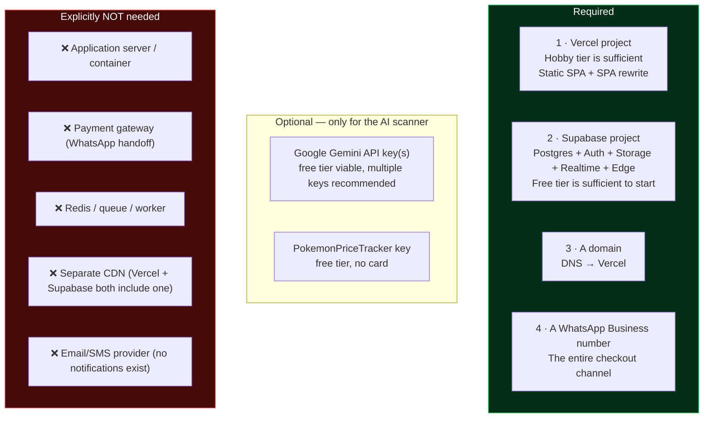
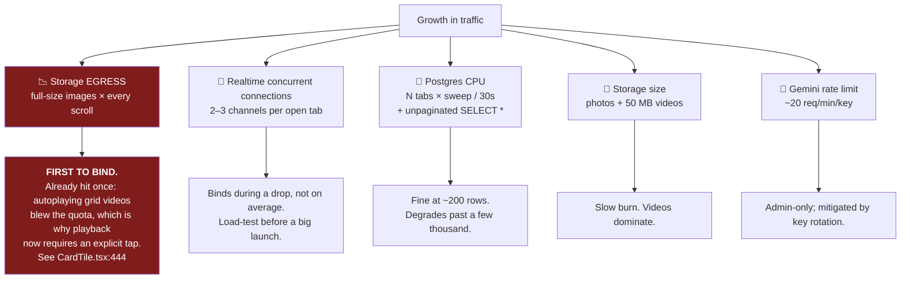
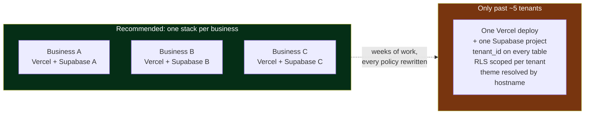

# Infrastructure Requirements

> **Pricing and quota figures move.** Every vendor number below is marked
> **[verify]** and should be checked against the current pricing page before you
> commit to it. The *shape* of the constraints — which limit binds first, and why
> — is derived from this codebase and is stable.

## 1. Minimum viable footprint

To stand up one instance of this system for one business you need exactly four
things:



No container, no VM, no orchestration, no CI runner required. That is the
system's biggest operational virtue.

## 2. Configuration inventory

### 2.1 Client-side (build-time, **public by definition**)

Any `VITE_*` variable is inlined into the JavaScript bundle and readable by
anyone. Set these in Vercel → Settings → Environment Variables:

| Variable | Purpose |
|---|---|
| `VITE_SUPABASE_URL` | Supabase project API URL |
| `VITE_SUPABASE_PUBLISHABLE_KEY` | The anon key — public by design; RLS is what protects data |
| `VITE_SUPABASE_PROJECT_ID` | Project ref |

⚠️ **`.env` is committed to the repository.** These three values are publishable,
so this is not a credential leak — but it is a habit that leaks the *next*
secret someone adds. Add `.env` to `.gitignore` and keep a `.env.example`.

### 2.2 Edge Function secrets (**genuinely secret**)

`supabase secrets set <NAME>=<value> --project-ref <ref>`

| Secret | Required | Purpose |
|---|---|---|
| `GEMINI_API_KEY` | one of these two | Single Gemini key |
| `GEMINI_API_KEYS` | takes priority if both set | Comma/newline separated list; rotated on rate-limit errors. **Use this** — each free key is ~20 req/min [verify] and a scanning session hits that |
| `GEMINI_VISION_MODEL` | optional | Defaults to `gemini-2.5-flash` |
| `POKEMONPRICETRACKER_API_KEY` | optional | Enables the Japanese-print price fallback |

### 2.3 Supabase project configuration not captured in code

These are dashboard settings. **They are load-bearing and undocumented anywhere
else in the repo — treat this table as the runbook.**

| Setting | Required value | Consequence if wrong |
|---|---|---|
| **Auth → allow new sign-ups** | **DISABLED** | 🔴 **Every RLS policy grants full write to `authenticated` with `USING (true)`. With sign-ups on, anyone who registers becomes a full administrator.** This is the single most important configuration item in the system. |
| Admin user | Created by hand: Auth → Users → Add user, "Auto Confirm User" on | No way to log into `/admin` |
| Email confirmations | Irrelevant if the user is auto-confirmed | Admin locked out |
| Realtime | Publication `supabase_realtime` must include 7 tables: `cards`, `claims`, `app_settings`, `transactions`, `box_breaks`, `break_slot_claims`, `live_chat_messages` (the migrations do this). `site_visits` is deliberately not published | Live stock/chat/slots stop updating; app still functions on manual fetch |
| Storage buckets | `card-images`, `card-videos`, `prize-images`, `break-images`, all **public** | Broken images |
| Storage upload size limit | Must be ≥ 50 MB to match `MAX_VIDEO_SIZE_BYTES` | Video uploads fail after client-side compression |
| Region | Choose nearest the audience — for INR/IST/Indian phone defaults, `ap-south-1` [verify current project region] | Added latency on every call, and every call is single-region |
| `pg_cron` | **Not currently enabled — should be** | See §5 |

### 2.4 Vercel configuration

- Framework preset: Vite. Build `npm run build`, output `dist`.
- `vercel.json` rewrites `/(.*)` → `/index.html`. **Mandatory** — without it every
  route except `/` 404s on refresh or direct link.
- ⚠️ **Preview deployments point at production Supabase.** There is only one
  Supabase project, so a preview branch writes to live data. Either accept it
  knowingly or create a second Supabase project for previews.

## 3. Resource profile per user action

Measured from the code paths, not from production telemetry (*inferred*).

| Action | DB queries | Realtime channels opened | Storage egress |
|---|---|---|---|
| Land on `/` | 2 selects + 1 insert (`site_visits`) | 2 | app bundle + `bg-pattern.jpg` (167 KB) + logo (655 KB ⚠️) |
| Open a category page | 1 select (whole category, `SELECT *`) + 1 RPC + 1 select | 2 | **one full-resolution image per visible tile** |
| Scroll a 40-listing grid | 0 | 0 | up to 40 full-size images; more where a tile has a multi-photo slideshow |
| Tap a video | 0 | 0 | up to 50 MB per video |
| Claim | 1 RPC + 1 RPC refetch | 0 | 0 |
| Checkout | 1 RPC | 0 | 0 |
| Idle on any page | 1 RPC / 30 s (sweep) + 1 update / 20 s (heartbeat) | — | 0 |
| Watch a break | 2 selects + chat subscribe | 3 | break image; **the YouTube stream is YouTube's bandwidth, not yours** ✅ |

### Two concrete asset problems

1. **`public/yanks-tcg-logo.png` is 655 KB** and is rendered at 32–56 px in a
   `<div>` on every page. `icon-512.png` is another 655 KB. These should be
   ~10–20 KB optimized PNG/WebP. Pure waste on every first load.
2. **No image transformation anywhere.** The grid serves whatever resolution the
   admin uploaded — typically a multi-megabyte phone photo — scaled down by CSS.
   Supabase Storage supports transform-on-read; using it is a one-line change per
   `getPublicUrl` call site and is the single highest-leverage egress fix.

## 4. Which limit binds first



**Egress is the binding constraint, and there is direct in-repo evidence.** The
comment at `src/components/CardTile.tsx:444` records that thumbnail videos used
to autoplay, "which is what blew out Supabase's egress quota" — so playback now
requires a tap and pauses on scroll-out. The same discipline has not yet been
applied to images.

### Free-tier reference points [verify all]

| Resource | Free tier (approx.) | This app's pressure |
|---|---|---|
| Database size | 500 MB | Very low — 9 narrow tables. `site_visits` grows fastest |
| Storage size | 1 GB | **Moderate** — a 50 MB video ceiling means 20 videos fills it |
| Storage + DB egress | ~5 GB/mo | **The constraint.** Full-size images on every grid scroll |
| Realtime concurrent connections | ~200 | **Watch during drops** — 2–3 channels per tab |
| Realtime messages/month | ~2 million | Unfiltered `cards` subscriptions multiply this by viewer count |
| Edge Function invocations | ~500 k | Trivial — admin-only |
| Project pausing | Free projects pause after ~1 week of inactivity | 🔴 A seasonal seller returning after a quiet fortnight finds a dead site. **Argument on its own for the paid tier.** |

## 5. The missing scheduled job — the one infrastructure gap

There is no scheduler anywhere in this project. Two functions need one; today
they run only from open browser tabs (see
[system-design-flows.md](./system-design-flows.md) Flow 3).

**Recommended fix** — enable `pg_cron` in the Supabase dashboard and add a
migration:

```sql
-- Replaces the browser-driven sweep. Run this and the 30s client interval
-- becomes a redundant safety net rather than the only mechanism.
CREATE EXTENSION IF NOT EXISTS pg_cron;

SELECT cron.schedule(
  'release-expired-claims',
  '* * * * *',
  $$SELECT public.release_expired_claims();$$
);

SELECT cron.schedule(
  'release-expired-break-slots',
  '* * * * *',
  $$SELECT public.release_expired_break_slot_claims();$$
);
```

Cost: zero. Effort: minutes. It removes the "stock locked when nobody's looking"
failure mode *and* the N-tabs-sweeping-redundantly load. This is the highest
value-per-minute change available anywhere in the system.

A second job worth adding once analytics volume grows:

```sql
SELECT cron.schedule('prune-site-visits', '0 3 * * *',
  $$DELETE FROM public.site_visits WHERE created_at < now() - interval '180 days';$$);
```

## 6. Cost model at three scales

All figures are order-of-magnitude planning numbers **[verify against current
pricing]**. "Concurrent" means simultaneous viewers during a live drop, which is
the load that matters for this product — average traffic is much lower.

### Scale A — current shape (≲200 listings, ≲50 concurrent, a few drops a week)

| Item | Cost |
|---|---|
| Vercel Hobby | $0 |
| Supabase Free | $0 |
| Gemini free tier | $0 |
| Domain | ~$12/yr |
| **Total** | **~$1/month** |

Caveat: free-project pausing after inactivity makes this fragile for a seller who
goes quiet between drops.

### Scale B — established (500–2,000 listings, 200–500 concurrent, drops several times a week)

| Item | Cost |
|---|---|
| Vercel Hobby or Pro | $0–20/mo |
| **Supabase Pro** | **~$25/mo** — buys no pausing, daily backups, higher egress and connection ceilings |
| Egress overage | $0–20/mo — **near-zero if you adopt image transforms** |
| Gemini | $0–10/mo |
| **Total** | **~$25–75/month** |

Required before this scale: image transforms, pagination or virtualized grids,
row-filtered Realtime subscriptions, and `pg_cron`.

### Scale C — multi-business (5+ tenants, each its own deployment)

The architecture is **single-tenant**: one Supabase project + one Vercel project
per business. That's a deliberate simplification with a real cost curve.

| Item | Cost |
|---|---|
| Supabase Pro × N | ~$25 × N/mo |
| Vercel Pro (one team, many projects) | ~$20/mo total |
| **5 businesses** | **~$145/month** |

At roughly 5+ tenants the arithmetic starts favouring true multi-tenancy (one
project, a `tenant_id` column, RLS scoped by tenant, per-domain theming). That is
**weeks** of work and changes every RLS policy in the schema. Until then,
duplicating the stack per business is the right call — cheaper, isolated, and one
tenant's traffic can never affect another's.



## 7. Operational runbook

### Standing up a new instance from scratch

1. Create the Supabase project (pick the region nearest the audience).
2. Run `supabase/migrations/20260710000000_fresh_project_schema.sql` — it is
   explicitly written to be the complete baseline for an empty project and
   supersedes the 8 legacy files.
3. Run, in order: `20260722000000_add_language_to_cards.sql`,
   `20260727000000_box_breaks.sql`, `20260728000000_add_slabs.sql`,
   `20260728010000_slab_as_item_type.sql`,
   `20260728030000_site_visits_analytics.sql`,
   `20260728031000_fix_analytics_rpc_grants.sql`. **Skip** the four untimestamped
   `add_*.sql` files and `20260728020000_backfill_visual_tiers_by_rarity.sql` —
   the former are superseded, the latter is a data backfill for one specific
   dataset.
4. Auth → **disable sign-ups**; add the admin user with Auto Confirm on.
5. Verify the 4 storage buckets exist and are public; set the upload limit
   ≥ 50 MB.
6. `supabase secrets set GEMINI_API_KEYS=…` then
   `supabase functions deploy identify-card --project-ref <ref>`.
7. Enable `pg_cron` and schedule the two sweeps (§5).
8. Vercel: import the repo, set the three `VITE_*` vars, deploy, attach the
   domain.
9. In-app: `/admin` → Sale Setup → set a sale start time (**until this is set the
   entire store is browse-only and every button reads "Coming Soon"**).

### Recovery scenarios

| Symptom | Likely cause | Action |
|---|---|---|
| Every route 404s except `/` | `vercel.json` missing/ignored | Restore the rewrite |
| Stock lower than the physical shelf | Expired claims never swept (no traffic) | Run `select release_expired_claims();`, then install `pg_cron` |
| Buttons say "Coming Soon" | `sale_start_time` null or future | Admin → Sale Setup |
| Broken images site-wide | Bucket not public, or a policy was dropped | Re-apply the storage policies from the baseline migration |
| Video upload fails | Post-compression file > 50 MB, or the project's upload limit is lower | Raise the Supabase limit or shorten the clip |
| "Identifying card…" hangs | Gemini quota across all keys | Add a key to `GEMINI_API_KEYS`; the 20 s abort prevents an indefinite hang |
| Live stock/chat stopped updating | Realtime publication or connection ceiling | Check the publication; check concurrent connections |
| Whole site dead after a quiet spell | **Free Supabase project paused** | Resume in the dashboard; upgrade to Pro to prevent recurrence |
| A price got wiped after ending a site-wide sale | Manual `sale_price` edit during the sale, overwritten by `pre_sale_price` | Restore from backup; avoid manual edits while a site-wide sale is live |

### Backup and data protection

- Database backups: whatever the Supabase plan provides (**free tier gives you
  little — this alone justifies Pro once real orders exist**).
- **`transactions` is the only record of what was sold.** There is no export in
  the app. A weekly CSV export (or a scheduled dump) is worth adding — it is the
  business's ledger.
- Storage objects are not versioned; a deleted listing deletes its media
  permanently (the delete path in `Admin.tsx` removes the objects).
- No PII beyond buyer name + phone in `claims`/`transactions`, and none at all in
  `site_visits`. A data-deletion request maps to deleting rows by phone number in
  those two tables. *Not legal advice.*

## 8. Monitoring — what to instrument

Currently there is **no** error tracking, no uptime check and no alerting.
`console.error` is the entire error-handling strategy for failed fetches. In
priority order:

1. **Uptime check on `/`** (any free monitor) — catches the paused-project failure
   mode.
2. **Error tracking** (Sentry or similar) — a single `main.tsx` init; today a
   buyer hitting a runtime error is invisible to you, made worse by
   `hmr.overlay: false` hiding errors in development too.
3. **A Supabase egress alert at ~70% of quota** — the constraint that has already
   bitten once.
4. **Funnel events**: NameGate shown → completed, category viewed, claim
   attempted → succeeded, cart opened, WhatsApp clicked. The `site_visits` table
   gives entry pages only; none of the funnel is measured, which makes every UX
   decision in
   [product/ux-friction-and-simplification.md](./product/ux-friction-and-simplification.md)
   a judgement call rather than a measured one.
5. **A daily "claims stuck > 15 min" query** — until `pg_cron` is installed, this
   is your canary.

## 9. Security checklist for a new deployment

- [ ] Supabase sign-ups **disabled** (this substitutes for a real role system)
- [ ] Exactly one admin user; strong unique password
- [ ] `.env` removed from git and added to `.gitignore`
- [ ] Any new admin RPC revoked from **`PUBLIC, anon`** — not `anon` alone (the
      lesson of migration `20260728031000`)
- [ ] No public SELECT policy added to `claims` or `transactions` (buyer phone
      numbers)
- [ ] `break_slot_claims` kept phone-free, since it *is* publicly readable
- [ ] Storage buckets public for read only; INSERT/DELETE `authenticated` only
- [ ] Gemini keys in Supabase secrets, never in a `VITE_*` variable
- [ ] Rate limiting considered for `live_chat_messages` (public INSERT, no limit,
      no moderation today)
- [ ] Session-UUID exposure understood: `get_my_claims(session_id)` returns a
      buyer's phone number to anyone holding that UUID
