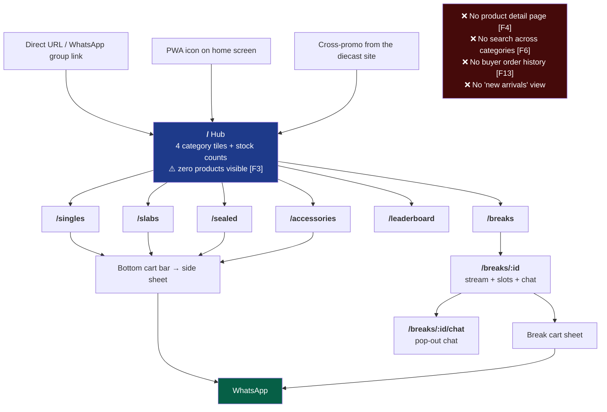
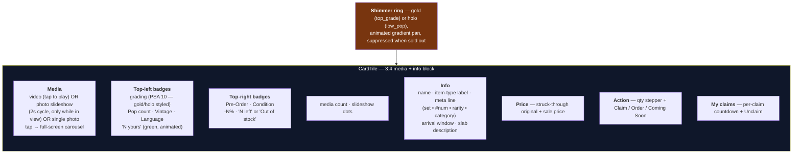
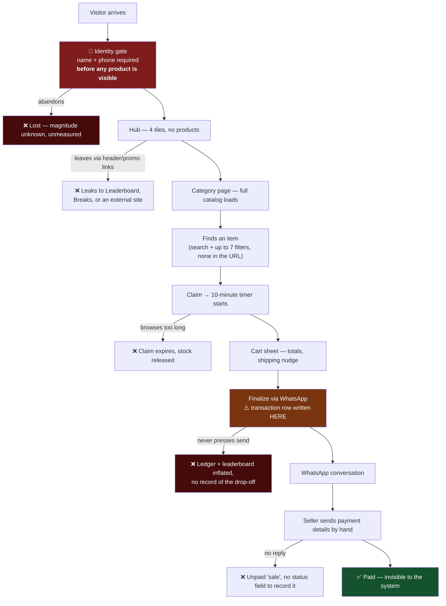

# Product & UX — Current State

A factual record of what exists today, screen by screen, with UX observations
kept separate from description. Recommendations live in
[ux-friction-and-simplification.md](./ux-friction-and-simplification.md); each
observation here is tagged `[F#]` where a fix is proposed there.

## 1. What the product is, in product terms

**A time-boxed drop with a race mechanic and a human close.**

A seller lists scarce physical inventory. At a scheduled time the store "goes
live" and buyers race to *claim* units. A claim is a 10-minute reservation, not a
purchase — the buyer must open WhatsApp within that window, where the seller
closes the sale by hand. Gamification (a monthly XP leaderboard with prizes) drives
repeat purchasing, and live box breaks with a YouTube stream and chat add an event
format on top.

Three consequences shape the whole experience:

1. **Scarcity is the product.** Realtime stock counts, "N left" badges, a
   ticking claim countdown and a "Someone beat you to it" error are all doing
   deliberate work.
2. **The store is closed most of the time.** Until `sale_start_time` passes,
   every button reads "Coming Soon" and the cart bar isn't rendered at all.
3. **The last mile is a conversation, not a checkout.** No payment, no order
   confirmation, no order history.

## 2. Information architecture

**Depth to first product: 2 taps** (hub → category), plus the identity modal
before either. **Depth to purchase: 5 interactions** (gate → category → claim →
cart → WhatsApp).

## 3. Screen: identity gate (`NameGate`)

**When**: on mount of the hub and of every category page and break page, whenever
`name` or `phone` is missing from `localStorage`.

| Element | Detail |
|---|---|
| Presentation | Centered modal, `sm:max-w-sm` |
| Escape hatches | **None.** Close button hidden (`[&>button]:hidden`), `onPointerDownOutside` and `onEscapeKeyDown` both prevented |
| Fields | Name (min 2 chars, max 50); phone (10–15 digits after stripping non-digits, `type=tel`) |
| Copy (new) | "Welcome!" / "Enter your name and phone to start claiming cards. Your phone helps us track your XP for the monthly leaderboard." |
| Copy (returning, no phone) | "One more thing!" / "…add it so we can reach you about your claims and track your leaderboard XP." — name pre-filled |
| CTA | "Enter the Sale", disabled until both valid |
| Verification | None — no OTP, no format check beyond digit count |

**Observations**

- `[F1]` A first-time visitor cannot see a single product before surrendering a
  phone number. This is the highest-suspicion conversion leak in the funnel: it
  asks for the highest-friction datum at the point of lowest trust, before any
  value has been demonstrated.
- `[F1]` The stated justification ("track your XP") is a benefit to a
  leaderboard the visitor hasn't seen yet.
- `[F2]` The gate is genuinely inescapable — no "browse first", no skip, no
  dismissal.
- ✅ The returning-buyer phone-only variant is a thoughtful migration path.
- `[F13]` The name and phone are never re-used to give the buyer anything (no
  order lookup, no claim recovery). They are collected for the seller's benefit
  only.

## 4. Screen: hub (`/`)

Top to bottom:

1. **PWA install banner** (dismissible).
2. **Hero** — logo tile + `SELLER_NAME`; two pill links (Box Breaks, Leaderboard;
   labels hidden below `sm`, icons only).
3. **H1** — "Pokémon Cards **Live Sale**" with a gradient span.
4. **Sub-line** — swaps on sale state: "Claim as many units as you want — first
   come, first served while stock lasts." / "Get ready! Preview the cards now, the
   live sale starts soon."
5. **Status chips** — `{N} listings in stock` (pulsing green dot);
   `Total Listed: ₹{sum of price × quantity_available}`; a countdown to the sale
   or `Sale time not set yet!`; `Trainer: {name}` with a `change` link.
6. **PromoBar** — two equal buttons: WhatsApp Group, Yanks Diecast (external).
7. **"Shop by category"** — 4 tiles (2 cols mobile, 4 desktop), each with icon,
   label, full description, and a `{N} in stock` pill.

**Observations**

- `[F3]` **No products.** The hub is pure navigation. Every visitor spends a tap
  before seeing anything for sale, on the screen where intent is highest.
- `[F7]` `Total Listed: ₹X` is inventory value, not a buyer benefit. It reads as
  a seller-facing metric leaking into the storefront.
- `[F7]` Category counts are *listings with stock*, not units — a subtle mismatch
  with the "N left" badges on tiles.
- `[F8]` Two of the four things in the header (Leaderboard, Box Breaks) and both
  PromoBar buttons lead **away** from products; one leaves the site entirely,
  above the fold.
- `[F17]` No "new arrivals" or "ending soon" surface anywhere, despite
  `created_at` being available and the product being drop-driven.
- ✅ Sale-state-dependent copy is a nice touch and correctly wired to realtime.

## 5. Screen: category pages (`/singles`, `/slabs`, `/sealed`, `/accessories`)

Four structurally identical pages sharing `useCategoryListing` and
`CategoryGrid`, differing in filter facets and copy from `categoryMeta.ts`.

| Zone | Contents |
|---|---|
| Header | "Back to Store" pill (prominent, recently made a pill deliberately); logo + seller name; H1 with category icon + label; category description |
| Search | Single input over name, set, card number, rarity. Client-side, over already-loaded rows |
| Filters | Mobile: hidden behind a `Filters` button with an active-state dot. Desktop: always visible row |
| Facets (Singles) | Set, Category, Rarity (all built from loaded data), Condition (from `CARD_CONDITIONS`), Pre-Orders toggle, Vintage toggle, Clear |
| Sort | Default (Newest), Price ↑, Price ↓ — **defaults to Price: High to Low** |
| Grid | 2 / 3 / 4 columns; 8 skeleton tiles while loading; distinct empty-state copy for "nothing listed" vs "nothing matches" |
| Cart | Fixed bottom bar, always present when the sale is live |

**Observations**

- `[F5]` **Filter state is not in the URL.** A filtered view can't be shared,
  bookmarked, or survive a refresh or a back-navigation.
- `[F6]` Search is scoped to one category. A buyer looking for "Charizard" must
  repeat the search on each page.
- `[F9]` **Sort defaults to most-expensive-first.** For most storefronts that
  suppresses conversion; for a scarcity-driven drop it may be deliberate. Worth
  measuring rather than assuming.
- `[F10]` Up to 7 filter controls with no result counts and no active-filter
  chips — you can only tell what's applied by reading each control.
- `[F10]` Facet values come from free-text columns, so typos become permanent
  filter options (the `visual_tier` backfill migration documents ~30 distinct
  hand-mapped rarity strings, which shows how noisy this gets).
- `[F11]` The whole category loads at once, unpaginated. Fine at ~200 rows;
  degrades hard beyond a few thousand.

## 6. Component: product tile (`CardTile`)

The densest surface in the product — 429 lines rendering up to **eight**
simultaneous status signals.

**Observations**

- `[F12]` **Badge overload.** A slab that is on sale, pre-order, vintage,
  non-English, partly claimed and low-population can show 8 badges over its
  artwork, on a 2-column mobile grid where each tile is ~170 px wide. The visual
  hierarchy collapses precisely on the highest-value items.
- `[F4]` The tile is the *only* product view. There is no detail page — tapping
  the media opens a media carousel, not a product page. `slab_description` is
  clamped to three lines with no way to read the rest.
- `[F14]` The quantity stepper sits **before** the claim action on every tile,
  even though the overwhelming majority of claims are for one unit. It is
  permanent UI serving an edge case.
- ✅ Suppressing the shimmer ring when sold out is exactly right — a "buy me"
  animation on something unbuyable reads as broken, and the code comment says so.
- ✅ Video-on-tap plus `IntersectionObserver` pausing is both a UX and a cost
  decision, correctly made.
- `[F16]` Shimmer rings, `pulse-glow` on every claim button and `animate-pulse`
  on live badges run continuously with **no `prefers-reduced-motion` guard**.

## 7. Flow: cart and checkout (`CheckoutSheet`)

**Bottom bar** — fixed, full-width, `backdrop-blur`, with a bag icon, a count
badge, the grand total, and a green "Checkout" pill. Rendered **disabled** when
empty, showing "Your cart is empty / Tap any listing to claim it". Not rendered at
all when the sale isn't live.

**Side sheet** — right-side, containing:

- Header: "Your Claims", "Claiming as {name}", a warning that claims expire in 10
  minutes, and the shipping policy line.
- Line items: thumbnail, name, qty, condition, pre-order arrival window, line
  total, and a live countdown. An `X` unclaims.
- Totals: subtotal, shipping (FREE or ₹150), grand total.
- Nudges: "Add ₹X more to waive the ₹150 shipping fee!" or "Your order qualifies
  for FREE shipping!"; a pre-order notice; an expired-claims warning.
- CTA: "Finalize via WhatsApp" — **disabled while any claim is expired**.

Clicking the CTA simultaneously calls `finalize_claims` and opens
`wa.me/{number}?text=…` with a fully composed message: greeting, numbered line
items with set, quantity, line total, condition, pre-order note and image URL, then
subtotal, shipping, total, the free-shipping nudge, and "Please share payment
details. 🙏".

**Observations**

- ✅ The WhatsApp message is genuinely the best-designed artifact in the product.
  It is a complete, portable order document.
- `[F15]` **The cart is not a cart.** Every item has an independent 10-minute
  timer, so the "cart" is a set of expiring reservations. A buyer who browses for
  12 minutes loses their earliest picks.
- `[F15]` Expired claims **block** checkout and must be removed manually. The
  reason is sound (the alternative silently changes the total at the moment of
  purchase) but the buyer is left doing cleanup at the worst moment.
- `[F13]` After the WhatsApp handoff the buyer has **nothing** — no confirmation
  screen, no reference number, no order record. Their only artifact is the
  WhatsApp message they may or may not have sent.
- `[F8]` The empty cart bar occupies permanent vertical space on a mobile
  storefront to say "you have nothing".
- Shipping is computed in the UI only and **never persisted**, so the seller's
  ledger can't reproduce the total the buyer saw.

## 8. Screen: leaderboard (`/leaderboard`)

A view selector switching between the current month and any past sale (via
`list_sales`). Shows prize copy/image for the selected view, then ranked rows:
crown / medal / award icons for the top three, then numbers, with each buyer's
name, XP (= sum of `final_price`) and purchase count. Top 100.

**Observations**

- The word "XP" and the framing are pure gamification over rupees spent — it
  works, and it is one of the most vertical-portable ideas in the product.
- `[F18]` **XP counts intent, not payment** (see
  [technical-assessment.md](../technical-assessment.md) R4). A buyer who abandons
  every WhatsApp conversation still climbs the board. With prizes attached, that
  is a fairness problem, not just a reporting one.
- Identity grouping is `(name, phone-or-session)`, so the same buyer on two
  devices without a phone on file appears twice and splits their score.
- Blank names render as "Anonymous Trainer".

## 9. Screens: box breaks (`/breaks`, `/breaks/:id`, `/breaks/:id/chat`)

**Index** — cards with image, status badge (`Starting Soon` / `🔴 Live Now` /
`Ended`, sorted live-first), title, and "N slots · ₹X each".

**Live break** — a three-zone layout: a **sticky** YouTube embed (sticky at every
breakpoint so it stays visible while picking slots), a live chat panel
(`h-[420px]` mobile, near-full-height sticky sidebar on desktop), and a slot grid
with multi-select and a "Claim N slots" button. Slot claims are publicly visible
with the claimant's name, updating live. A separate cart sheet handles the
WhatsApp handoff.

**Observations**

- ✅ Using DOM order (video → chat → slots) as the mobile stacking order and
  re-laying it with `lg:col-span-2` / `lg:row-span-2` on desktop is an elegant
  one-layout solution.
- `[F16]` On a phone, a sticky video plus a 420 px chat panel leaves very little
  room for the slot grid — the thing being sold competes for space with two
  ambient elements.
- The slot grid is numbered squares with no indication of **what is in the box**
  (no product list, no odds, no team/hit list). Slot 7 and slot 12 are
  indistinguishable to a buyer.
- Chat is unauthenticated with an arbitrary display name and no rate limit (see
  [technical-assessment.md](../technical-assessment.md) R7).
- Break revenue writes **no** transaction row, so breaks appear in no sales
  history and earn no leaderboard XP — a product inconsistency, not just a
  reporting gap.

## 10. Screen: admin console (`/admin`)

Login (email + password, "{SELLER_NAME} Console"), then five tabs.

| Tab | Contents |
|---|---|
| **Listings** | The listing form (left) + the listings table with filter/sort and a claims panel (right) |
| **Box Breaks** | Create/manage breaks, flip status, manage slot claims |
| **Sales History** | Past sales, transaction counts, totals, prize editing |
| **Statistics** | Visitor analytics — recharts area chart, device/browser/OS/referrer/entry-page breakdowns, 7/30/90-day window |
| **Sale Setup** | Sale start time (IST-pinned date + time picker), site-wide sale %, prize editor, leaderboard toggle |

**The listing form** — roughly 20 fields in one column, conditionally rendered by
listing type:

Listing Type → *(cards & slabs)* TCG database search + "Scan Card" → Photo
(camera / file / URL) + additional photos → Video (optional, compressed
client-side) → Name → Set → *(cards & slabs)* Card # + Rarity → Category →
Language → Price → Sale Price → Quantity → Condition → Pre-Order toggle →
Vintage toggle → Visual Tier → *(slabs only)* Grading Company, Grade, Cert
Number, Population Count, Population Note, Slab Description → **Publish**.

**Observations**

- ✅ The AI scan flow is well-judged: it opens the OS camera (better macro focus
  than a browser video stream), shows a confirm step, and treats price suggestions
  as editable starting points — never pre-filling the low-confidence
  `japanese_proxy` estimate.
- ✅ A "Duplicate listing" action exists and is the main tool for volume.
- No **draft** state — a listing is live the instant it's published, which for a
  drop-based business means no staging a drop in advance.
- No bulk operations and no CSV import. Listing 100 items is 100 passes through
  the form.
- No preview of how the tile will look, despite `visual_tier` being an editorial
  choice about exactly that.
- Site-wide sale confirmation is a native `confirm()` dialog on an action that
  rewrites every price in the catalog.
- The 1,318-line single-component implementation is why admin changes are slow
  (see [technical-assessment.md](../technical-assessment.md) R11).

## 11. Cross-cutting UX characteristics

| Aspect | State |
|---|---|
| **Mobile-first** | ✅ Genuinely — 2-col grids, bottom cart bar, safe-area insets, haptics via `navigator.vibrate`, PWA manifest |
| **Theme** | Dark only. `darkMode: ["class"]` is configured but there is no light palette and no toggle |
| **Feedback** | Sonner toasts throughout, plus haptics on claim (20 ms), error (40-30-40) and checkout (15-30-15) |
| **Loading** | Skeleton tiles on grids, spinners elsewhere. No optimistic UI — a claim waits for the server round-trip |
| **Errors** | Toasts for user-facing failures; `console.error` for data-fetch failures, which a buyer never sees. A failed catalog load renders as an empty store |
| **Empty states** | ✅ Well done — distinct copy for "nothing listed" vs "nothing matches", with a Clear Filters action |
| **Accessibility** | `aria-label` on icon buttons and Radix keyboard handling inherited. But: dark-only, gold-on-dark contrast, continuous animation with no `prefers-reduced-motion` guard, no visible skip-link, and an inescapable modal that traps keyboard users |
| **Offline** | None. No service worker — a reload without a network is a blank page, despite being installable as an app |
| **i18n** | None. English hardcoded in JSX. Ironically the *products* carry a `language` field |
| **SEO / sharing** | Static meta tags for the site only. No per-product OG tags because there are no product pages. Unindexable catalog |

## 12. The funnel as it exists

**Five drop-off points, and not one of them is instrumented.** `site_visits`
records entry paths only — there is no event for gate-shown, gate-completed,
claim-attempted, cart-opened or WhatsApp-clicked. Every recommendation in
[ux-friction-and-simplification.md](./ux-friction-and-simplification.md) is
therefore a reasoned judgement rather than a measured conclusion, which is itself
the first thing to fix.

## 13. What the UX gets genuinely right

Worth stating plainly, because the friction list is long and the baseline is good:

1. **The scarcity mechanic is coherent.** Realtime counts, "N left", the
   countdown, the race error and the leaderboard all reinforce one feeling.
2. **The WhatsApp message is an excellent order document** — complete, portable,
   and it meets buyers in the app they already use.
3. **Mobile-first is real**, not retrofitted: thumb-reachable cart, safe-area
   insets, haptics, 2-column grids, installable.
4. **Empty and loading states are handled** with specific copy, which most
   projects at this size skip.
5. **The visual identity is confident.** The gold/holo shimmer tiers give
   high-value inventory a treatment that feels appropriate to collectibles, and
   suppressing it when sold out shows real attention.
6. **The admin AI scanner is a genuine operational advantage** — it turns a
   photograph into a mostly-filled listing, which is the seller's actual
   bottleneck.
