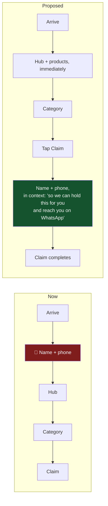
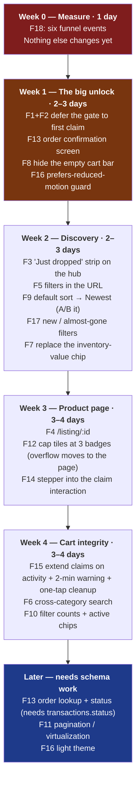

# UX Friction Audit and Simplification Plan

18 friction points, ranked. Each has an observed cause in the code, a proposed
change, an effort estimate and a confidence level.

**A caveat that applies to everything below.** The funnel is not instrumented —
`site_visits` records entry paths only, and nothing measures gate abandonment,
claim rate, cart abandonment or WhatsApp click-through. So these are reasoned
judgements from the code and from general commerce patterns, **not measured
findings**. F18 (instrument the funnel) is listed last but should arguably be done
first, because it converts the rest of this list from opinion into evidence.

Effort key: **S** ≤ half a day · **M** 1–3 days · **L** 1–2 weeks.

## 1. Ranked friction table

| # | Friction | Severity | Effort | Confidence |
|---|---|---|---|---|
| F1 | Phone number required before any product is visible | 🔴 Critical | S | High |
| F2 | Identity gate is inescapable — no browse-first path | 🔴 Critical | S | High |
| F4 | No product detail page; nothing is shareable or linkable | 🔴 High | M | High |
| F15 | The "cart" is a set of independently expiring reservations | 🔴 High | M | High |
| F13 | Buyer gets no order record after the WhatsApp handoff | 🔴 High | M | High |
| F3 | Hub shows zero products | 🟠 High | S | High |
| F12 | Up to 8 badges per tile on a ~170 px mobile card | 🟠 Medium | S | Medium |
| F5 | Filter/search state not in the URL | 🟠 Medium | S | High |
| F6 | No cross-category search | 🟠 Medium | M | High |
| F9 | Sort defaults to most-expensive-first | 🟠 Medium | S | Low |
| F10 | 7 filter controls, no counts, no active chips, dirty facet values | 🟠 Medium | M | Medium |
| F8 | Empty cart bar and outbound links take prime space | 🟡 Medium | S | Medium |
| F14 | Quantity stepper on every tile for a rare case | 🟡 Low | S | Medium |
| F7 | Seller-facing metrics on the storefront | 🟡 Low | S | Medium |
| F16 | Accessibility: contrast, unguarded motion, modal trap | 🟠 Medium | M | High |
| F17 | No "new arrivals" / "ending soon" despite a drop model | 🟡 Medium | S | Medium |
| F11 | Whole catalog loads unpaginated | 🟡 Low now | M | High |
| F18 | Funnel completely uninstrumented | 🔴 Critical | S | High |

---

## 2. The four that matter most

### F1 + F2 — The identity gate is the biggest suspected leak

**Now**: on first mount, a modal with the close button hidden, outside-click
prevented and Escape prevented demands a name and a 10–15 digit phone number.
Nothing is visible behind it. The justification offered to the visitor is
leaderboard XP — a feature they haven't seen.

**Why it's costly**: this asks for the single highest-friction datum in commerce
at the point of *lowest* trust, before any value is demonstrated. On a
mobile-first storefront reached by a WhatsApp group link, a meaningful share of
first-time visitors will bounce rather than type a phone number into an unknown
site.

**Recommendation — defer the gate to first claim.**



The mechanics already support this — `CardTile` accepts `disabled={!buyerName &&
isSaleLive}` and `handleClaim` already returns early without a name. The change is
to stop rendering the gate on mount and instead trigger it from the claim action,
with the pending claim resumed after submit.

**Also**: the phone justification should be the honest one — *"so we can send you
payment details on WhatsApp"* — which is a benefit, not a leaderboard mechanic.

**Effort**: S (a few hours across `NameGate` and the five mounting sites).
**Expected impact**: the largest single conversion lever available. Instrument
before and after.

---

### F4 — There is no product page

**Now**: the tile is the only product view. Tapping the media opens a media
carousel. `slab_description` is clamped to three lines with no expansion. There is
no route for a listing, so:

- A buyer can't send a friend a link to one card.
- The seller can't post a specific item to Instagram or a WhatsApp group with a
  direct link.
- No per-item OG image or title, so any share preview is generic.
- Nothing is indexable by search engines.

For a business whose primary distribution is *sharing links in chat groups*, this
is a distribution problem as much as a UX one.

**Recommendation**: add `/listing/:id` rendering full media, full description, all
attributes, price, stock, the claim control, and per-item OG meta.

The catch worth stating honestly: OG tags need to exist in the HTML the crawler
receives, and this is a static SPA — so a genuinely correct implementation needs
either prerendering, a small edge function that injects meta for crawler
user-agents, or a move to a framework with SSR. **Deliver the route first (S), and
treat share previews as a follow-up decision (M–L).** The route alone fixes
linkability and the description clamp, which is most of the value.

**Effort**: M. **Confidence**: high.

---

### F15 — The cart is not a cart

**Now**: each claim carries its own independent 10-minute countdown. A buyer who
claims an item, keeps browsing for 12 minutes and then opens the cart finds their
first pick gone. Expired claims **block** checkout and must be removed by hand at
the moment of purchase.

The 10-minute pressure is deliberate and correct for the scarcity mechanic — the
problem is not the timer, it's that the timer is per-item and starts on the
*first* claim, penalising exactly the behaviour the store wants (browsing more).

**Recommendation — reset the window on activity.** Extend every pending claim's
`claimed_at` whenever the buyer claims anything new. Same pressure, no punishment
for continued shopping.

```sql
-- Inside claim_units, after the new claim is inserted: give the buyer's
-- existing pending claims the same fresh deadline, so browsing on doesn't
-- expire what they already picked.
UPDATE public.claims
SET claimed_at = now()
WHERE buyer_session_id = _session_id AND status = 'claimed';
```

Two supporting changes:

- **Warn before expiry**, don't only report it: a toast at 2 minutes remaining
  with "Extend" / "Checkout now".
- **Offer one-tap cleanup** when expired claims block checkout ("Remove 2 expired
  items and continue") instead of requiring per-item deletion.

**Effort**: M (SQL + toast + cleanup affordance). **Confidence**: high.

---

### F13 — The buyer leaves with nothing

**Now**: after the WhatsApp handoff there is no confirmation screen, no reference
number, no order history. The buyer's only artifact is a WhatsApp message they may
not have sent. Meanwhile the seller's `transactions` row exists regardless.

**Recommendation, in increasing order of effort:**

1. **S — A confirmation screen.** After finalize, show "Order sent — reference
   #ABC123" using the short form of `order_id`, with what to expect next and a
   button to re-open the WhatsApp message. Costs nothing and closes the loop.
2. **M — Order lookup by phone.** A `get_my_orders(phone)` RPC and a simple
   `/orders` screen. **Note the security implication**: phone numbers are
   guessable, so this needs a code sent over WhatsApp, not phone-alone access.
3. **M — Order status.** Requires `transactions.status` (see
   [technical-assessment.md](../technical-assessment.md) R4). Once it exists,
   showing the buyer "confirmed / paid / shipped" is straightforward and is the
   single biggest trust improvement available.

**Effort**: S for #1 — do that now regardless of the rest. **Confidence**: high.

---

## 3. The rest, grouped

### Discovery (F3, F6, F17, F5, F9, F10, F11)

| # | Change | Effort |
|---|---|---|
| **F3** | Add a "Just dropped" horizontal strip of 6–8 newest listings to the hub, above the category tiles. The hub already fetches every row — this needs no new query, only different columns. Turns a pure-navigation page into a shopping page | **S** |
| **F6** | An "All items" route or a global search that queries across `item_type`. `useCategoryListing` takes a single type today; accept an array or `null` for all | **M** |
| **F17** | "New this week" and "Almost gone" (`quantity_available === 1`) filters. Both are one-line predicates over already-loaded data, and both fit a drop-driven business that currently surfaces neither | **S** |
| **F5** | Sync search/filters/sort to `useSearchParams`. Makes filtered views shareable, bookmarkable and back-button-correct. Removes the "did my filters reset?" confusion entirely | **S** |
| **F9** | Change the default sort to Newest, and A/B it against price-desc. Newest matches the drop model; price-desc suppresses conversion in most storefronts but may be deliberate here. **Measure, don't assume** | **S** |
| **F10** | Show a result count next to the Filters button ("Filters · 12 results"); render active filters as removable chips; add counts per facet option. Longer-term, back the facets with lookup tables so typos stop becoming filter options | **M** |
| **F11** | Not urgent at ~200 listings. Before ~1,000, add either pagination or a virtualized grid plus server-side filtering. Track it as a scaling item | **M** |

### Product tiles (F12, F14, F7, F8)

**F12 — badge overload.** A slab that is on-sale, pre-order, vintage,
non-English, partly claimed and low-population shows 8 badges over its artwork on
a ~170 px tile. The hierarchy collapses on exactly the most valuable items.

Recommendation — pick a strict priority and cap at three:

1. **Stock urgency** always (`N left` / `Out of stock`) — it drives the mechanic.
2. **Then one** commercial signal: `-N%` if discounted, else `Pre-Order`.
3. **Then one** identity signal: grading badge for slabs, else `Vintage`, else
   language.
4. Everything else moves to the (new) product page.
5. `N yours` stays — it's personal state, not decoration, and it's the reason a
   buyer can scan a grid for what they've already picked.

**Effort**: S. **Confidence**: medium (worth a design opinion, not just a rule).

**F14 — the stepper.** Move the quantity control into the claim interaction rather
than showing it permanently: tap Claim → claims 1 → the tile then shows
`1 yours` with `+ / −`. Most claims are single-unit; the stepper is permanent UI
for an edge case, and it costs horizontal space on the tightest layout in the app
(the code comments already record a fight over pixels here). **Effort**: S.

**F7 — seller metrics on the storefront.** `Total Listed: ₹X` is inventory value.
Replace with something a buyer cares about — "12 items under ₹500" or "3 new
today". **Effort**: S.

**F8 — prime space.** Hide the cart bar entirely when empty rather than rendering
it disabled (it already returns `null` when the sale isn't live, so the pattern
exists). Move the outbound Yanks Diecast link to a footer — an external link above
the fold on a storefront is a leak. **Effort**: S.

### Accessibility (F16)

| Issue | Fix | Effort |
|---|---|---|
| Continuous animation with no guard — shimmer rings, `pulse-glow` on every claim button, `animate-pulse` on live badges | Wrap in `@media (prefers-reduced-motion: reduce)` and disable. A vestibular-sensitive user currently gets a grid of pulsing gold rings with no escape | **S** |
| Gold `hsl(48 96% 53%)` text on dark, and `muted-foreground` at `hsl(240 5% 65%)` on small text | Audit against WCAG AA; the muted small text is the most likely failure | **S** |
| The identity gate traps keyboard users (Escape prevented, no close) | Resolved for free by F1/F2 — a deferred, dismissible gate | — |
| Dark-only theme | A light palette is a real ask for some verticals; it's a second `:root` block, not a refactor, since the token layer already exists | **M** |
| No skip-link; headers repeat on every page | Add a skip-to-content link | **S** |

### Measurement (F18) — do this first

Nothing in the funnel is measured. Six events, inserted into a small
`app_events(event, session_id, path, meta jsonb, created_at)` table (or any
analytics SDK), would turn this entire document from opinion into evidence:

1. `gate_shown` → `gate_completed` (**the F1 hypothesis, directly testable**)
2. `category_viewed` (which category actually converts)
3. `claim_attempted` → `claim_succeeded` (how often the race is lost)
4. `cart_opened`
5. `whatsapp_clicked` (**the real conversion event today**)
6. `claim_expired` (**the F15 hypothesis, directly testable**)

The infrastructure already exists — `site_visits` proves the pattern of a public
INSERT policy with no PII. **Effort**: S. This is the highest-value item on the
page.

---

## 4. Simplification: what to remove, not add

Friction lists tend to grow features. Four things this product would be better
without:

| Remove | Why |
|---|---|
| **The empty cart bar** | Permanent mobile space to say "you have nothing" |
| **The always-visible quantity stepper** | Permanent UI for a rare case (F14) |
| **`Total Listed: ₹X`** | A seller metric on a buyer surface (F7) |
| **Outbound links above the fold** | Two of four header actions and both promo buttons lead away from products; one leaves the site (F8) |

And one thing to *stop* doing: **surfacing every attribute on the tile.** The
existence of `slab_description`, `population_note`, `cert_number` and a language
field is an argument *for* a product page (F4), not for a denser tile.

---

## 5. Sequenced plan



**Roughly 3–4 weeks** of product work for the whole list, front-loaded so the
highest-impact change (F1) ships in week 1 with measurement already in place to
prove it.

---

## 6. Which of these carry over to other businesses

Relevant because the point of this analysis is adapting the system for other
sellers. Fixes that are *structural* pay off once and benefit every future
instance; fixes that are *editorial* must be redone per business.

| Fix | Portable? |
|---|---|
| F1/F2 deferred gate | 🟢 Structural — every vertical benefits |
| F4 product page | 🟢 Structural — arguably more valuable for higher-consideration goods (watches, art) than for cards |
| F15 activity-extended claims | 🟢 Structural — the claim mechanic is the transferable core |
| F13 confirmation + order lookup | 🟢 Structural |
| F5 filters in the URL | 🟢 Structural |
| F18 funnel events | 🟢 Structural |
| F16 accessibility | 🟢 Structural |
| F3 "just dropped" strip | 🟢 Structural, 🟡 content differs |
| F12 badge priority | 🟡 The *rule* is portable, the specific badges are per-vertical |
| F10 facet quality | 🟡 Depends on each vertical's attribute set (and argues for the `attributes jsonb` change in [data-model.md](../data-model.md) §7) |
| F9 default sort | 🔴 Per-business — measure each one |
| F7 storefront metrics | 🔴 Per-business copy |

**Practical implication**: do F1, F2, F13, F15, F18, F5 and F16 **once, in this
codebase, before stamping out the second business.** They are the difference
between reusing a template and reusing a *product*.
