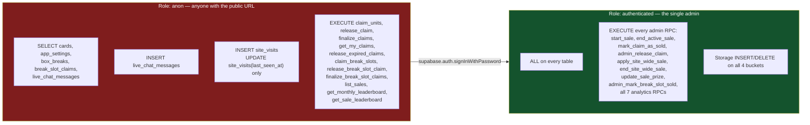
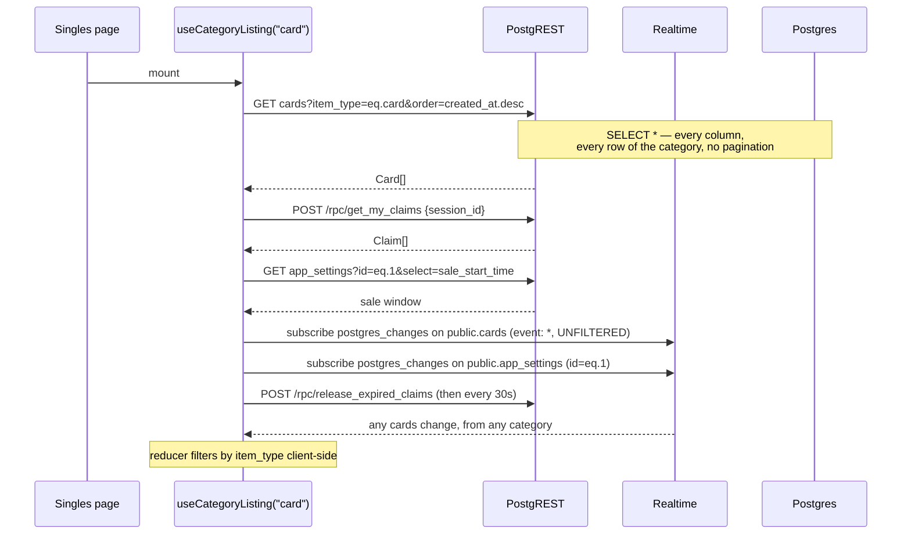
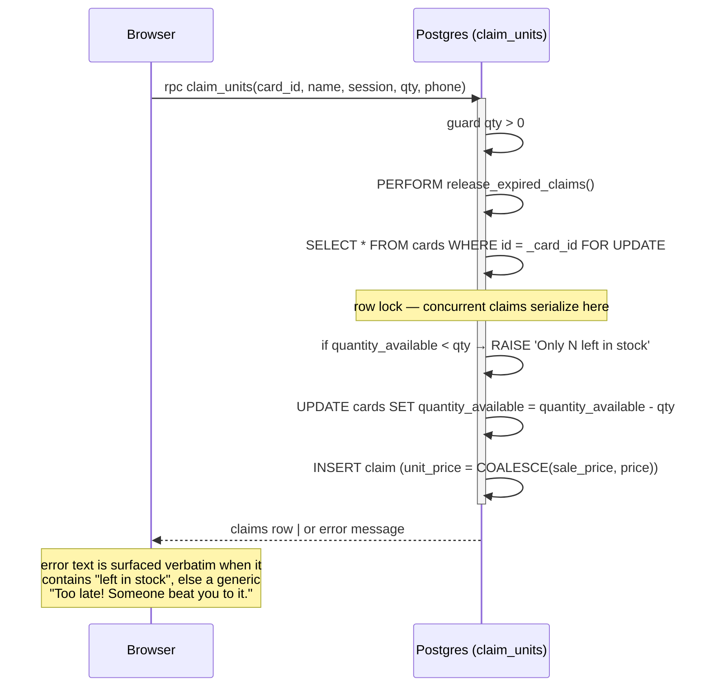
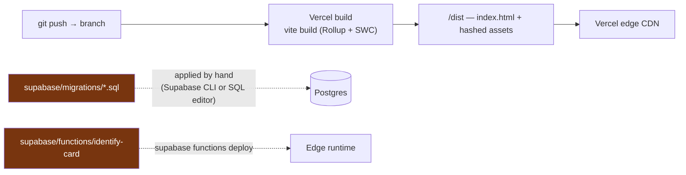

# System Architecture

## 1. Architectural style

**Client-heavy, backend-as-a-service, database-centric.** There is no
application server. A static SPA holds all presentation and orchestration; the
authoritative business rules live in PostgreSQL as `SECURITY DEFINER` functions;
one Deno Edge Function exists solely to hold a secret the browser must not see.

Three properties follow from this and explain almost every other decision:

1. **Every write that must be correct is a single database round-trip.** Stock
   decrement + claim insert is one transaction inside `claim_units`, not a
   read-modify-write in JavaScript. Concurrency correctness comes from
   `SELECT ... FOR UPDATE`, not from the client.
2. **The browser holds the anon key and is fully untrusted.** Security is entirely
   RLS policies + function-level grants. Any hole there is a public hole.
3. **There is no place to run scheduled work.** No cron, no queue, no background
   worker. Anything periodic is either done by an open browser tab or not done.

## 2. Runtime topology

```mermaid
flowchart TB
  subgraph client["Untrusted — visitor's browser"]
    direction TB
    SPA["React 18 SPA<br/>Vite bundle, hash-named assets"]
    LS[("localStorage<br/>buyer name / phone / session UUID<br/>Supabase auth session<br/>analytics visitor_id")]
    SS[("sessionStorage<br/>analytics visit_id")]
    SPA <--> LS
    SPA <--> SS
  end

  subgraph vercel["Vercel — static edge"]
    CDN["CDN + SPA rewrite<br/>all paths → /index.html"]
  end

  subgraph supabase["Supabase project govervcxumkbpmnnotpr"]
    direction TB
    PGRST["PostgREST<br/>table SELECT + RPC POST"]
    GOTRUE["GoTrue Auth<br/>1 admin user, sign-up disabled"]
    RT["Realtime<br/>postgres_changes over WebSocket"]
    ST["Storage<br/>4 public buckets"]
    EF["Edge Function: identify-card<br/>Deno, holds GEMINI_API_KEY"]
    PG[("PostgreSQL<br/>9 tables · 30 functions<br/>RLS on every table")]
    PGRST --> PG
    GOTRUE --> PG
    RT --> PG
    ST --> PG
  end

  subgraph external["Third-party"]
    GEM["Google Gemini<br/>generateContent + Search grounding"]
    PTCG["api.pokemontcg.io<br/>card catalog + USD prices"]
    PPT["pokemonpricetracker.com<br/>JP price proxy"]
    FX["open.er-api.com<br/>USD→INR rate"]
    YT["YouTube iframe embeds"]
    WA["wa.me deep links"]
  end

  SPA -->|"initial load"| CDN
  SPA -->|"HTTPS + anon key"| PGRST
  SPA -->|"admin email/password"| GOTRUE
  SPA <-->|"WebSocket"| RT
  SPA -->|"upload / public GET"| ST
  SPA -->|"functions.invoke"| EF
  EF --> GEM
  EF --> PPT
  SPA -->|"direct fetch, no key"| PTCG
  SPA -->|"direct fetch"| FX
  SPA -.->|"iframe"| YT
  SPA -.->|"window.open"| WA

  style client fill:#450a0a,stroke:#ef4444,color:#fff
  style supabase fill:#052e16,stroke:#22c55e,color:#fff
  style external fill:#1e1b4b,stroke:#818cf8,color:#fff
```



## 3. Trust boundaries and the security model

There are exactly **two** trust levels in this system: `anon` and
`authenticated`. There is no third.



### What RLS deliberately hides from the public

| Data | Protection | Why |
|---|---|---|
| `claims` rows (contain `buyer_phone`) | No public SELECT policy at all; buyers reach their own claims only via `get_my_claims(session_id)`, a `SECURITY DEFINER` function | Prevents harvesting buyer phone numbers via a raw PostgREST call |
| `transactions` | `authenticated` only | Sales ledger with names and phones |
| `site_visits` raw rows | `authenticated` SELECT; public may INSERT and may UPDATE **only** `last_seen_at` via a column-level grant | Public can log a visit but not read traffic data |
| The 7 analytics aggregate RPCs | Revoked from `PUBLIC` **and** `anon`, granted to `authenticated` | See the note below |

### Two security lessons already learned in this codebase (both verified)

1. **Supabase auto-grants EXECUTE on every new public-schema function to
   `anon`.** Without explicit `REVOKE`, the anon key could call `start_sale`,
   `mark_claim_as_sold`, `apply_site_wide_sale`, etc. The fresh-schema migration
   revokes each admin function from `anon` by name for this reason, and the
   comment records that it was confirmed live.
2. **`REVOKE ... FROM anon` is not enough.** Postgres also grants EXECUTE to the
   `PUBLIC` pseudo-role at creation time, and `anon` inherits through it. The
   analytics migration `20260728030000` revoked only from `anon`, which left all
   7 analytics RPCs callable by the anon key; migration `20260728031000` exists
   purely to add `FROM PUBLIC`. **Any new admin RPC must revoke from
   `PUBLIC, anon` — copy that pattern, not the older one.**

### The structural weakness

`authenticated` *is* admin. Every policy reads `TO authenticated USING (true)`.
There is no `profiles`/`roles` table and no `auth.uid()` check anywhere. The only
thing keeping this safe is that public sign-up is disabled in the Supabase
dashboard — a **configuration** guarantee, not a **code** guarantee, and it is
not captured in any migration. See
[technical-assessment.md](./technical-assessment.md) risk R2.

## 4. Where state lives

State ownership is unusually clear in this codebase, which is a strength.

| State | Home | Lifetime | Notes |
|---|---|---|---|
| Catalog (`cards`) | Postgres | Permanent | Also the stock counter: `quantity_available` is denormalized and mutated by RPCs |
| Cart | `claims` table, keyed by `buyer_session_id` | **10 minutes** | Server-side cart with a TTL — unusual and central to the product |
| Buyer identity | `localStorage` (`tcg_buyer_name`, `tcg_buyer_phone`, `tcg_buyer_session`) | Until browser data cleared | The session UUID is the only cart key; losing it loses the cart |
| Admin session | `localStorage` via Supabase Auth (`persistSession: true`, `autoRefreshToken: true`) | JWT refresh cycle | `src/integrations/supabase/client.ts` |
| Sale window, prizes, site-wide discount | `app_settings` singleton row `id = 1` | Permanent | Realtime-published so all clients react to a change instantly |
| Order ledger | `transactions` | Permanent, append-only in practice | Denormalizes `card_name` and `photo_url` at sale time so deleting a listing doesn't corrupt history |
| Analytics visit | `site_visits` + `localStorage` visitor id + `sessionStorage` visit id | Permanent row; ids per browser/tab | Duration derived as `last_seen_at - created_at` |
| UI state (filters, selections, quantity steppers) | React `useState`, per component | Per navigation | Not in the URL — see §7 |

**Not present:** no client-side cache layer. TanStack Query is installed and its
provider is mounted in `src/App.tsx`, but there is not a single `useQuery` call
in the codebase (verified by grep). All fetching is hand-rolled `useEffect` +
`useState`.

## 5. Request paths

### 5.1 Read path — a category page



Two things to notice, both listed as issues in
[technical-assessment.md](./technical-assessment.md):

- The `cards` Realtime subscription is **unfiltered** — a change to a sealed
  product wakes every client on the Singles page, which then discards it.
- Every storefront tab issues a `release_expired_claims` RPC every 30 seconds.
  With N viewers that's N sweeps per 30s doing the same work; with 0 viewers it's
  zero sweeps and expired claims never release.

### 5.2 Write path — claiming stock

All buyer writes go through RPC, never direct table access. This is the
load-bearing design decision.



The unit price is **snapshotted into the claim** at claim time, so a price change
or a site-wide discount mid-claim cannot alter what the buyer was quoted.
Similarly `transactions` snapshots `card_name` and `photo_url`. That's careful
work and worth preserving through any refactor.

### 5.3 Write path — box break slots

`claim_break_slots(break_id, slot_numbers[], name, session)` is all-or-nothing
across a set of slots. Each `INSERT` sits in its own sub-transaction
(`BEGIN ... EXCEPTION WHEN unique_violation`) purely so the error message can name
the specific contested slot; the re-`RAISE` is left uncaught, which aborts the
whole function and rolls back every insert already made in the call. Race safety
comes from `UNIQUE (break_id, slot_number)`, not from locking.

### 5.4 Server-side path — the AI card scanner

The only code in this system that runs on a server we control.

```mermaid
sequenceDiagram
    participant A as Admin (CardScanner)
    participant EF as Edge Function identify-card
    participant G as Gemini
    participant PPT as PokemonPriceTracker
    participant PT as pokemontcg.io

    A->>A: OS camera picker → base64 JPEG
    A->>EF: functions.invoke("identify-card", {image})
    EF->>G: vision call, temperature 0, 20s timeout
    Note over EF,G: rotates through GEMINI_API_KEYS<br/>only on rate-limit errors
    G-->>EF: {name, set, number, language, printVariant, uncertain}
    alt non-English print and confident
        EF->>G: text call + google_search grounding for a market price
        G-->>EF: {amountUsd, confident} + groundingChunks (cited URLs)
        opt not confident
            EF->>PPT: Japanese-print price as a labeled proxy
        end
    end
    EF-->>A: identity + priceSuggestion + _debug
    A->>PT: (client) catalog + USD price lookup for English prints
    A->>A: USD→INR via cached open.er-api.com rate
    Note over A: suggestion is pre-filled as an EDITABLE<br/>starting point, never authoritative;<br/>japanese_proxy is shown but never pre-filled
```

Design points worth keeping: the identity prompt is forbidden from producing a
price (the model has no market data and would invent one); cited URLs come only
from the API's structural `groundingMetadata`, never from model-authored text;
each Gemini attempt has a hard 20 s abort so a hanging call can't leave the
spinner stuck and tempt a retry that burns more quota.

## 6. Realtime channel inventory

| Page | Channel | Table | Filter |
|---|---|---|---|
| `/` | `hub-cards-changes` | `cards` | none — refetches all count rows on any change |
| `/` | `hub-settings-changes` | `app_settings` | `id=eq.1` |
| category pages | `category-{type}-cards-changes` | `cards` | none — filtered client-side |
| category pages | `category-{type}-settings-changes` | `app_settings` | `id=eq.1` |
| `/breaks` | `box-breaks-list` | `box_breaks` | none — refetches the list |
| `/breaks/:id` | `break-slot-claims-{id}` | `break_slot_claims` | `break_id=eq.{id}` ✅ |
| `/breaks/:id` | `box-break-{id}` | `box_breaks` | `id=eq.{id}` ✅ |
| `/breaks/:id` chat | (in `LiveChat`) | `live_chat_messages` | per break |
| `/admin` | cards + claims channels | both | none |

Seven tables are in the `supabase_realtime` publication: `cards`, `claims`,
`app_settings`, `transactions`, `box_breaks`, `break_slot_claims` and
`live_chat_messages`. `site_visits` was given `REPLICA IDENTITY FULL` but never
added to the publication, so it produces no fan-out — harmless, since nothing
subscribes to it.

Every one of them is set to `REPLICA IDENTITY FULL`, which sends the entire
old and new row on every change — necessary for DELETE handling here, but it
means Realtime payload size scales with row width, and `cards` is a wide table.

**`claims` is published to Realtime but no anon client can ever receive it**,
because there is no public SELECT policy — Realtime respects RLS. The code
correctly compensates by explicitly refetching `get_my_claims` after each claim
action, and the reason is documented in `src/hooks/useCategoryListing.ts`.

## 7. Routing and URL design

11 routes, all client-side (`react-router-dom` v6 `BrowserRouter`), with
`vercel.json` rewriting every path to `/index.html`.

```
/                     hub (no products)
/singles              item_type = card
/slabs                item_type = slab
/sealed                item_type = sealed_product
/accessories          item_type = accessory
/leaderboard          monthly + per-sale rankings
/breaks               box break index
/breaks/:breakId      live break: stream + slots + chat
/breaks/:breakId/chat pop-out chat window
/admin                console (login-gated)
*                     NotFound
```

**No URL carries state.** Search text, four filter selects, two toggles and the
sort order all live in `useState` and vanish on navigation or refresh. There is
**no product detail route** — a listing cannot be linked to, shared, or indexed.
Both are product-level consequences of an architectural choice; see
[product/ux-friction-and-simplification.md](./product/ux-friction-and-simplification.md)
F4 and F5.

## 8. Storage architecture

Four **public** buckets: `card-images`, `card-videos`, `prize-images`,
`break-images`. Public read by policy; INSERT/DELETE restricted to
`authenticated`.

- Objects are served at their full uploaded resolution. **No image
  transformation or resizing is used anywhere** — the grid renders the same file
  the admin uploaded, scaled by CSS.
- Videos are compressed **client-side before upload** using
  `canvas.captureStream()` + `MediaRecorder` (`src/lib/videoCompression.ts`) —
  no ffmpeg.wasm. It prefers MP4 where the browser can encode it, falls back to
  WebM, and returns the original file untouched on any failure. The real guard is
  the 50 MB check in `src/config.ts`.
- Deleting a listing also deletes its storage objects (`src/pages/Admin.tsx`
  around line 520) — a real cleanup path, not a leak.

Egress from these buckets is the system's most likely first hard limit; see
[infrastructure-requirements.md](./infrastructure-requirements.md) §4.

## 9. Scheduled work — the gap

There is **no** cron, no `pg_cron` extension enabled in any migration, no Vercel
cron, no scheduled Edge Function. Two things that need to be periodic are
currently driven by open browser tabs:

| Should be scheduled | Currently | Failure mode when nobody is on the site |
|---|---|---|
| `release_expired_claims()` | every 30 s from each open storefront/admin tab, plus inside `claim_units` | Stock stays reserved indefinitely; buyers see fewer units than exist |
| `release_expired_break_slot_claims()` | every 30 s from each open `/breaks/:id` tab, plus inside `claim_break_slots` | Break slots stay locked between streams |

Also note the **duplicated constant**: `CLAIM_DURATION_MINUTES = 10` in
`src/config.ts` drives the countdown UI, while `interval '10 minutes'` is
hardcoded inside two SQL functions. Changing one without the other desynchronizes
what the buyer sees from what the database enforces. Both files carry a comment
saying "keep these in sync", which is the honest admission that the design
doesn't enforce it.

## 10. Build and deploy



The frontend has a deploy pipeline. **The database and the Edge Function do
not** — migrations and function deploys are manual, out-of-band steps, and there
is no CI running lint, typecheck or tests on a push (there is no
`.github/workflows` directory). The migration folder is also not a reliably
replayable history: 8 legacy files target an older shared project and are
explicitly superseded by `20260710000000_fresh_project_schema.sql`, and 4 more
(`add_condition_to_cards.sql`, `add_sale_price_to_cards.sql`,
`add_video_url_to_cards.sql`, `create_card_videos_bucket_and_policy.sql`) have no
timestamp prefix and therefore no defined ordering.

Build provenance is visible in the tooling: `lovable-tagger` is a dev-mode Vite
plugin and `.dyad/screenshot/` holds editor artifacts, so this app was scaffolded
and iterated in AI app builders (Lovable, then Dyad). That explains both the
59-file app with 49 vendored shadcn components and the several installed-but-
unused libraries catalogued in [tech-stack.md](./tech-stack.md) §4.

## 11. Architectural strengths worth preserving through any change

1. **Correctness lives in one place.** Every concurrency-sensitive mutation is a
   single SQL function with an explicit row lock or unique constraint. Do not
   move this to the client.
2. **Price and name snapshots.** Claims freeze `unit_price`; transactions freeze
   `card_name` and `photo_url`. History survives catalog edits and deletions.
3. **Least-privilege RPC surface.** Buyers cannot write to any table directly —
   only through five narrowly-scoped functions. This is why buyer phone numbers
   aren't harvestable.
4. **Design tokens, not hardcoded styles.** Every color is an HSL CSS variable
   in one file. This is the single reason re-theming for another business is a
   hours-not-weeks job.
5. **Genuine egress discipline, learned the hard way.** Videos play only on tap;
   thumbnail slideshows and video playback pause via `IntersectionObserver` when
   scrolled out. The comments record why.
