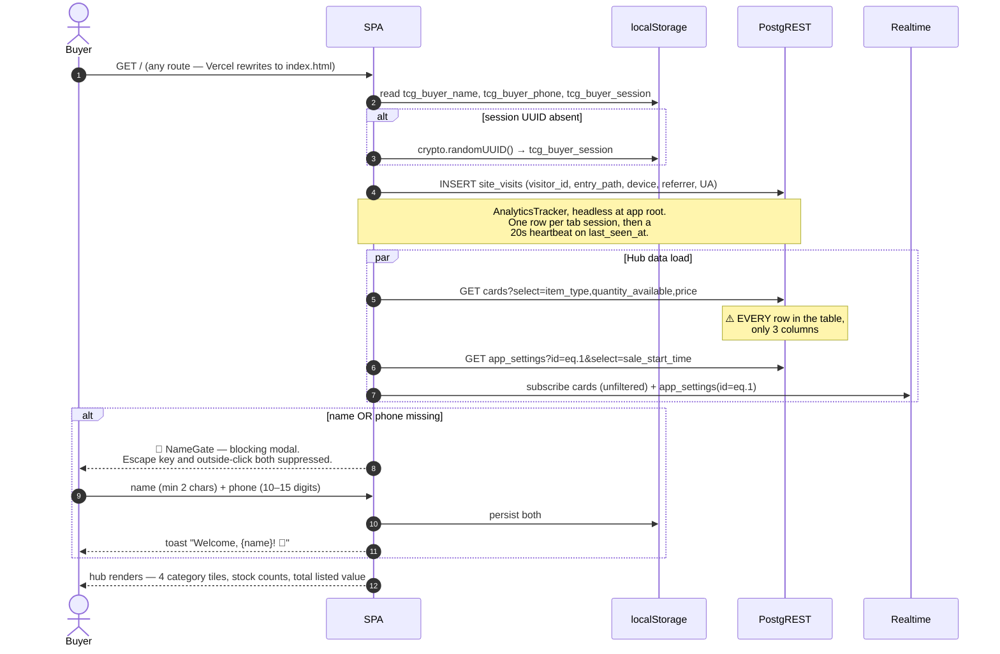
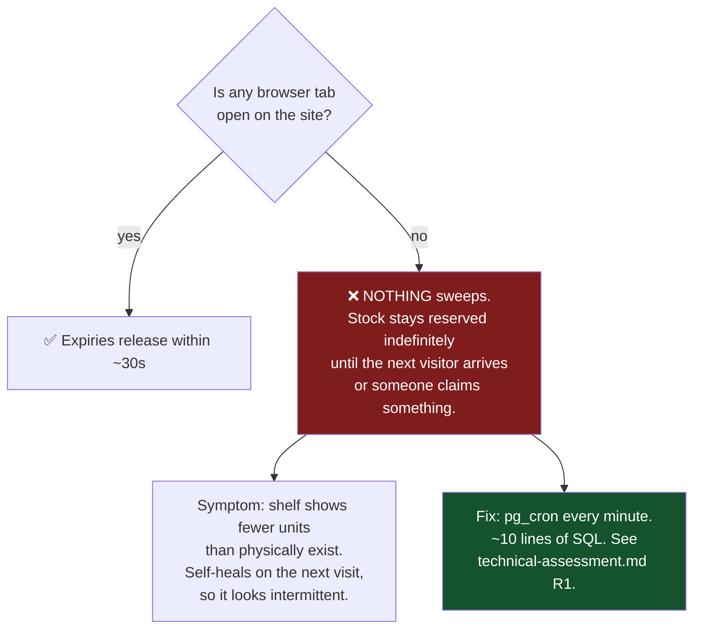
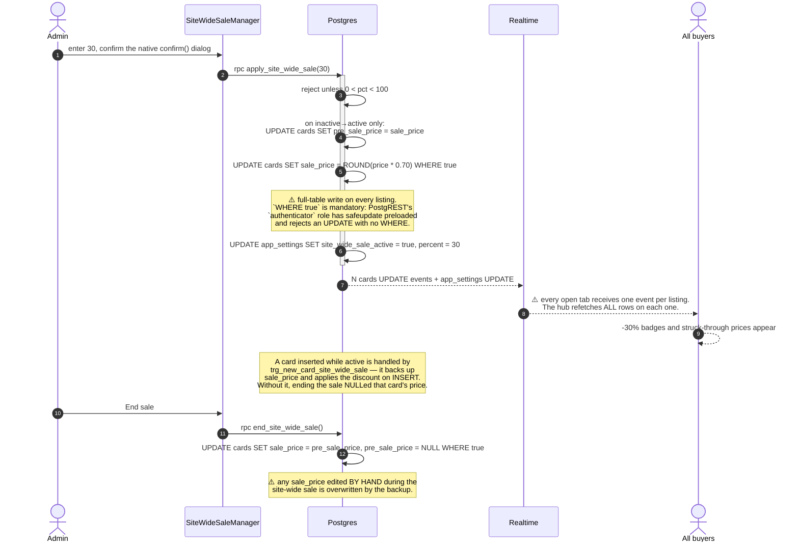
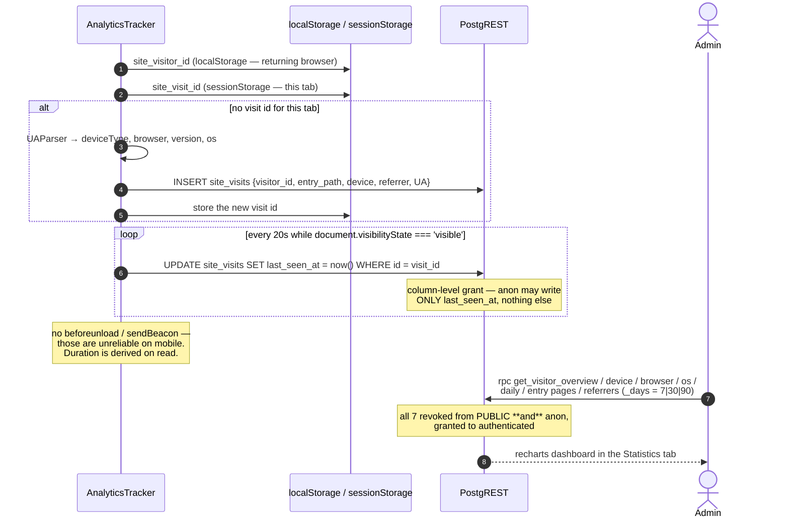

# System Design Flows

Eight flows define this product. Each is given as a sequence diagram with the
design notes and failure modes that matter. Participants are consistent
throughout: **Buyer**, **Admin**, **SPA**, **PostgREST**, **Realtime**,
**Postgres**, **Storage**, **EdgeFn**, **WhatsApp**.

---

## Flow 1 — First visit and identity capture



**Design notes**

- The gate is rendered independently on the hub *and* on every category page, so
  a buyer who deep-links to `/singles` meets it there. Consistent, but it's the
  same modal instantiated in five places.
- Returning buyers who predate the phone requirement get a phone-only variant
  ("One more thing!") with the name pre-filled — a thoughtful migration path.
- The countdown to `sale_start_time` is client-clock based. A buyer with a skewed
  device clock sees the wrong state; the database is the real arbiter because
  `claim_units` doesn't check the sale window at all.

**Failure modes**

| Condition | Result |
|---|---|
| Sale time not set (`NULL`) | Chip reads "Sale time not set yet!"; all claim buttons read "Coming Soon"; the cart bar isn't rendered |
| `app_settings` row missing | `PGRST116` is explicitly tolerated; treated as no sale time |
| `cards` fetch fails | `console.error` only — counts silently render as 0 |
| Buyer clears browser data | New session UUID; existing claims become orphaned and only expire out after 10 minutes |

---

## Flow 2 — The claim (the core transaction)

```mermaid
sequenceDiagram
    autonumber
    actor B as Buyer
    participant SPA as CardTile / useCategoryListing
    participant PR as PostgREST
    participant PG as Postgres claim_units
    participant RT as Realtime
    actor O as Other buyers

    B->>SPA: stepper → qty 2, tap "Claim"
    SPA->>SPA: guard isSaleLive; guard name present
    SPA->>SPA: navigator.vibrate(20)
    SPA->>PR: rpc claim_units(card_id, name, session, 2, phone)
    PR->>PG: execute as SECURITY DEFINER

    activate PG
    PG->>PG: if qty <= 0 → RAISE
    PG->>PG: PERFORM release_expired_claims()
    PG->>PG: SELECT * FROM cards WHERE id = ? FOR UPDATE
    Note over PG: 🔒 row lock — concurrent claimants<br/>serialize here. This is the entire<br/>concurrency-correctness story.
    alt quantity_available < 2
        PG-->>PR: RAISE 'Only N left in stock'
    else stock sufficient
        PG->>PG: UPDATE cards SET quantity_available = quantity_available - 2
        PG->>PG: INSERT claims (unit_price = COALESCE(sale_price, price), claimed_at = now())
        PG-->>PR: claims row
    end
    deactivate PG

    alt error
        SPA->>SPA: navigator.vibrate([40,30,40])
        SPA-->>B: message containing "left in stock" shown verbatim,<br/>otherwise "Too late! Someone beat you to it."
    else success
        SPA->>PR: rpc get_my_claims(session)
        Note over SPA,PR: explicit refetch — a Realtime<br/>subscription on `claims` can never<br/>fire for anon (no public SELECT policy)
        SPA-->>B: toast "Claimed 2 × {name}!" + 10:00 countdown starts
    end

    PG-->>RT: cards UPDATE
    RT-->>O: stock badge drops live on every open tab
    RT-->>SPA: (also received by the claimant, filtered client-side by item_type)
```

**Why this is the strongest part of the codebase**: the read-check-decrement-
insert is one transaction behind one row lock. Two buyers racing for the last
copy cannot both win, and no client-side code can break that invariant. Preserve
this through any refactor.

**Two subtleties**

1. `claim_units` **does not check the sale window.** The gate is purely
   client-side (`handleClaim` returns early if `!isSaleLive`). A crafted request
   with the public anon key can claim before the sale opens. *Verified.*
2. The buyer's phone number is passed on **every** claim call and written to every
   claim row — which is exactly why `claims` has no public SELECT policy.

---

## Flow 3 — Claim expiry (three independent paths)

```mermaid
sequenceDiagram
    autonumber
    participant T1 as Buyer's tab (ClaimCountdown)
    participant T2 as Any open storefront tab
    participant T3 as Another buyer claiming
    participant PR as PostgREST
    participant PG as Postgres

    rect rgb(30,58,138)
    Note over T1: Path A — the claimant is watching
    T1->>T1: setInterval 1s; expiry = claimed_at + 10 min
    T1->>T1: isPast(expiry) → onExpired()
    T1->>PR: rpc release_claim(claim_id, session)
    PR->>PG: delete if still 'claimed' AND session matches; return stock
    T1-->>T1: toast "Claim expired — {name} was released"
    end

    rect rgb(6,78,59)
    Note over T2: Path B — any tab sweeps for everyone
    loop every 30 seconds, from EVERY open storefront/admin tab
        T2->>PR: rpc release_expired_claims()
        PR->>PG: return stock for + DELETE all 'claimed' rows older than interval '10 minutes'
    end
    end

    rect rgb(120,53,15)
    Note over T3: Path C — piggybacked on a new claim
    T3->>PR: rpc claim_units(...)
    PR->>PG: PERFORM release_expired_claims() as step 2
    end
```



**Also note**: with N viewers, all N tabs run the same sweep every 30 s — N
redundant full-table scans per half-minute. Both the outage *and* the stampede
are solved by the same scheduled job.

The countdown constant is duplicated: `CLAIM_DURATION_MINUTES = 10`
(`src/config.ts`) drives the UI, `interval '10 minutes'` is hardcoded in two SQL
functions. Change one alone and the buyer's timer disagrees with the database.

---

## Flow 4 — Checkout via WhatsApp

```mermaid
sequenceDiagram
    autonumber
    actor B as Buyer
    participant CS as CheckoutSheet
    participant PR as PostgREST
    participant PG as Postgres finalize_claims
    participant WA as WhatsApp

    B->>CS: tap the fixed bottom cart bar
    CS->>CS: subtotal = Σ(qty × unit_price)
    CS->>CS: shipping = subtotal in (0, 1500) ? ₹150 : ₹0
    CS->>CS: per-item pre-order window = created_at + 15..20 days
    CS->>CS: hasExpiredClaims? → disable the finalize button
    CS-->>B: line items, countdowns, subtotal / shipping / total,<br/>free-shipping nudge, pre-order notice

    B->>CS: tap "Finalize via WhatsApp"
    par both happen on the same click
        CS->>PR: rpc finalize_claims(session)
        PR->>PG: claims → checked_out;<br/>INSERT one transaction per claim,<br/>shared order_id, guarded by NOT EXISTS;<br/>sale_id = get_active_sale_id() (may be NULL)
    and
        CS->>WA: window.open(wa.me/{SELLER_WHATSAPP}?text=…)
    end

    Note over WA: Message: greeting, numbered line items with<br/>set, qty, line total, condition, pre-order window,<br/>image URL per item, subtotal, shipping, total,<br/>free-shipping nudge, "Please share payment details 🙏"

    B->>WA: (may or may not actually press send)
    Note over PG: ⚠️ The transaction row already exists either way.
    WA-->>B: seller replies by hand with payment details
    Note over PG: ⚠️ No field records whether payment happened.
```

**Design notes**

- The WhatsApp message is impressively complete — it's the real "order
  confirmation" of this product, and it's plain text so it survives any client.
- **Shipping is never persisted.** It exists only in the cart UI and the message
  text, so a total reconstructed from `transactions` won't match what the buyer
  saw.
- Expired claims **block** finalize rather than being auto-dropped, so the buyer
  must manually unclaim them first. Minor friction with a clear reason (the
  alternative is silently changing the order total at the moment of purchase).
- `finalize_claims` is idempotent per claim thanks to the `NOT EXISTS` guard, so
  a double-tap can't double-write.

---

## Flow 5 — Admin publishes a listing (with the AI scanner)

```mermaid
sequenceDiagram
    autonumber
    actor A as Admin
    participant AD as Admin page
    participant SC as CardScanner
    participant EF as Edge Fn identify-card
    participant GEM as Gemini
    participant PPT as PokemonPriceTracker
    participant PT as pokemontcg.io
    participant FX as open.er-api.com
    participant ST as Storage
    participant PR as PostgREST

    A->>AD: /admin → email + password → Supabase Auth
    A->>AD: choose Listing Type (card / slab / sealed / accessory)

    alt Path 1 — AI scan
        A->>SC: "Scan Card"
        SC->>SC: opens the OS camera picker, not getUserMedia
        Note over SC: deliberate: native autofocus/macro<br/>beats a browser video stream at<br/>close range
        SC->>EF: functions.invoke("identify-card", {base64 JPEG})
        EF->>GEM: vision call, temperature 0, 20s abort
        Note over EF,GEM: rotates GEMINI_API_KEYS only on<br/>rate-limit errors; any other error<br/>fails fast on the first key
        GEM-->>EF: {name(EN), set, number, language, printVariant, uncertain, note}
        alt non-English AND confident
            EF->>GEM: text call + google_search grounding
            GEM-->>EF: {amountUsd, confident} + groundingChunks
            opt not confident
                EF->>PPT: Japanese-print price (labeled proxy)
            end
        end
        EF-->>SC: identity + priceSuggestion + _debug
        SC->>FX: cached USD→INR (1h TTL, fallback 90)
        SC-->>A: confirm sheet — editable, never authoritative.<br/>gemini_search may pre-fill Price;<br/>japanese_proxy is shown but NEVER pre-filled
        AD->>PT: (English prints) catalog + market price lookup
    else Path 2 — catalog search
        A->>AD: type "Charizard" or "base1 4"
        AD->>PT: GET /cards?q=… (name or set.id+number)
        PT-->>AD: up to 12 matches
        A->>AD: pick one → name, set, number, rarity, image, USD price prefill
    else Path 3 — manual
        A->>AD: type everything
    end

    A->>AD: photo (camera / file / URL), optional video
    AD->>AD: compressVideo() — canvas.captureStream + MediaRecorder,<br/>prefers MP4, falls back to WebM, returns original on failure
    AD->>AD: hard reject > 50 MB
    A->>AD: price, sale price, quantity, condition, language, category,<br/>pre-order, vintage, visual tier, + slab fields if applicable
    A->>AD: Publish
    AD->>ST: upload to card-images / card-videos → getPublicUrl
    AD->>PR: INSERT cards {…}
    Note over PR: trg_new_card_site_wide_sale fires:<br/>if a site-wide sale is live, backs up<br/>sale_price and applies the discount
    PR-->>AD: row
    Note over AD: Realtime pushes it to every open storefront —<br/>it appears on the shelf with no refresh
```

**Design notes worth keeping**

- The identity prompt is explicitly **forbidden to output a price** — the model
  has no market data and would fabricate one. Pricing comes from a separate,
  clearly-labeled grounded search.
- Cited source URLs are taken only from the API's structural
  `groundingMetadata.groundingChunks`, never from URLs the model typed, because a
  model-authored URL can be invented.
- The `japanese_proxy` fallback is shown to the admin but never pre-filled,
  because it was observed matching the wrong print (a common instead of a rare
  parallel). That distinction between "suggest" and "pre-fill" is good judgment
  encoded in the UI.
- The prompt explicitly tells the model that a copyright year later than its
  training cutoff is **not** evidence of a fake — a real class of AI-vision bug,
  caught and fixed.

**Friction**: this is a ~20-field single-column form with one Publish button. No
draft state, no bulk upload, no CSV import. A "Duplicate listing" action exists
and is the main volume tool.

---

## Flow 6 — Live box break

```mermaid
sequenceDiagram
    autonumber
    actor B as Buyer
    actor O as Other viewers
    participant LB as LiveBreak page
    participant PR as PostgREST
    participant PG as Postgres claim_break_slots
    participant RT as Realtime
    participant YT as YouTube
    participant WA as WhatsApp

    B->>LB: /breaks/:id
    LB->>PR: GET box_breaks?id=eq.:id  ·  GET break_slot_claims?break_id=eq.:id
    Note over PR: break_slot_claims IS publicly readable —<br/>seeing whose name is on which slot<br/>in real time is the product.<br/>Safe because it holds no phone number.
    LB->>RT: subscribe break_slot_claims(break_id=eq.:id) + box_breaks(id=eq.:id)
    Note over LB,RT: ✅ these two are properly row-filtered,<br/>unlike the storefront's cards channel
    LB->>YT: iframe embed of youtube_video_id
    LB->>PR: rpc release_expired_break_slot_claims() every 30s

    B->>LB: multi-select slots 3, 7, 12
    B->>LB: "Claim 3 slots"
    LB->>PR: rpc claim_break_slots(break_id, [3,7,12], name, session)
    activate PG
    PG->>PG: sweep expiries; load break; reject if status = 'ended'
    loop each slot
        PG->>PG: range check 1..total_slots
        PG->>PG: INSERT — sub-transaction catches unique_violation
        Note over PG: on collision: RAISE 'Slot N was just taken'.<br/>Uncaught → whole call rolls back.<br/>ALL-OR-NOTHING.
    end
    deactivate PG
    PG-->>RT: INSERTs
    RT-->>O: slots turn "taken" with the claimant's name, live
    RT-->>B: same

    B->>LB: chat message (1–300 chars, public INSERT policy)
    LB->>PR: INSERT live_chat_messages
    PR-->>RT: fan-out to all viewers

    B->>LB: BreakCheckoutSheet → finalize
    LB->>PR: rpc finalize_break_slot_claims(break_id, session)
    Note over PG: ⚠️ slots → checked_out, but NO transactions row.<br/>Break revenue never reaches the ledger,<br/>the sales history, or the leaderboard.
    LB->>WA: wa.me with the slot list
```

**Design notes**

- Slot race safety comes from `UNIQUE(break_id, slot_number)` rather than a lock —
  simpler and correct, and the sub-transaction exists purely so the error can name
  the specific slot.
- The video is `sticky` at every breakpoint so it stays in view while picking
  slots; DOM order (video → chat → slots) is also the mobile stacking order, with
  `lg:col-span-2` / `lg:row-span-2` re-laying it into video + chat-sidebar + slots
  on desktop. Neat trick, one layout, no duplication.
- Chat has a **public INSERT policy and no rate limit, no moderation, and no
  authorship check** — `display_name` is whatever the client sends. Anyone with
  the anon key can flood or impersonate. Admin can delete. See risk R7 in
  [technical-assessment.md](./technical-assessment.md).
- `/breaks/:id/chat` is a pop-out chat window for multi-window viewing.

---

## Flow 7 — Site-wide sale



Two real hazards here, both worth knowing before running a large catalog:

1. **Realtime stampede.** Discounting 200 listings emits 200 `cards` UPDATE
   events, and the hub's handler refetches every row per event. At 200 rows it's
   survivable; at 2,000 it's a self-inflicted load spike on every connected
   client. Fix: debounce the hub refetch and/or replace it with a counts RPC.
2. **Lossy round-trip.** `pre_sale_price` is a single backup slot. Manual price
   edits during the sale are lost on end.

---

## Flow 8 — Visitor analytics



**No PII**: no name, email, phone or IP. `visitor_id` is a random localStorage
token meaning "this browser has been here before".

**Gaps**: one row per tab session means **no per-page navigation tracking** — you
learn entry pages, never journeys, and never which category converts. There is
also no funnel instrumentation at all: nothing records NameGate abandonment,
claim rate, cart abandonment or WhatsApp click-through. For a team about to
optimize this funnel, that's the most valuable missing dataset. See
[product/ux-friction-and-simplification.md](./product/ux-friction-and-simplification.md)
F18.

---

## Cross-flow summary

| Flow | Trigger | Authority | Realtime? | Failure when it breaks |
|---|---|---|---|---|
| 1 Identity | First load | Client (localStorage) | — | Buyer blocked from browsing |
| 2 Claim | Buyer tap | **Postgres row lock** | ✅ stock to all | Buyer sees "Too late!" |
| 3 Expiry | Timer / any tab / new claim | Postgres | ✅ stock returns | **Stock locked forever with no traffic** |
| 4 Checkout | Buyer tap | Postgres + WhatsApp | — | Ledger inflated by abandonment |
| 5 Publish | Admin | Postgres + Storage | ✅ appears live | Upload fails → no listing |
| 6 Break | Buyer tap | **UNIQUE constraint** | ✅ slots + chat | Slot collision error |
| 7 Site sale | Admin | Postgres full-table write | ⚠️ N events | Manual price edits lost |
| 8 Analytics | Page load + 20s | Postgres | — | Silent gap in stats |
