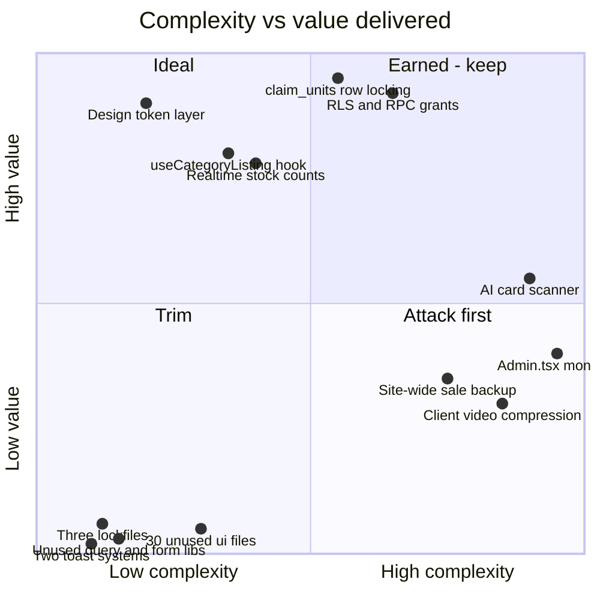

# Technical Assessment

## 1. Verdict

**This is a well-built small system with a small number of specific, cheap-to-fix
problems. Do not rebuild it.**

The parts that are hard to get right — atomic stock reservation under
concurrency, a least-privilege data API over a public anon key, price snapshotting
so history survives catalog edits, a design-token layer that makes re-theming a
one-file job — are all already correct. The parts that are wrong are mostly
*missing* rather than *misbuilt*: no scheduler, no pagination, no tests, no CI,
and about 2,500 lines of scaffolding that was never deleted.

Two files (`Admin.tsx` at 1,318 lines, `CardTile.tsx` at 429) are 29% of the
hand-written code and are exactly the files a re-skin touches most. Splitting
them is the highest-leverage refactor for your stated goal.

The code also shows a pattern worth calling out explicitly: **its comments record
real, verified-in-production failures and why the fix is what it is** — the egress
blowout from autoplaying videos, the `REVOKE ... FROM anon` that didn't work, the
`WHERE true` required by `safeupdate`, the FX rate that went 16% stale, the
`japanese_proxy` price that matched the wrong print. That is unusually honest
engineering documentation and it materially reduces the risk of adapting this
codebase, because the traps are already labeled.

## 2. Strengths (preserve these through any change)

| # | Strength | Where | Why it matters for adaptation |
|---|---|---|---|
| S1 | **Concurrency correctness lives in one place.** Stock decrement + claim insert is one transaction behind `SELECT ... FOR UPDATE`; slot claiming is guarded by a unique constraint | `claim_units`, `claim_break_slots` | The race conditions are already solved. Any refactor that moves this to JS reintroduces them |
| S2 | **Least-privilege data API.** Buyers cannot write to any table directly — only 5 narrowly-scoped RPCs. `claims` has no public SELECT, which is what keeps buyer phone numbers off the public API | Schema RLS + grants | Reusable verbatim for any vertical |
| S3 | **Price and identity snapshots.** `claims.unit_price` freezes the quote; `transactions.card_name`/`photo_url` survive listing deletion; FKs are `ON DELETE SET NULL` | Schema | History integrity is already right |
| S4 | **Design tokens, not hardcoded styles.** ~25 HSL variables in one file drive every color; components reference semantic names | `src/index.css`, `tailwind.config.ts` | **The single reason a re-theme is hours, not weeks** |
| S5 | **One shared data layer for 4 category pages.** Fetch + realtime + sweep + claim/unclaim in one hook; pages own only their filter UI | `useCategoryListing.ts` | Adding a category is a page file, not new plumbing |
| S6 | **Generated types as a schema contract.** Every component types against `Database["public"]["Tables"][...]` | `types.ts` | Schema drift becomes a compile error |
| S7 | **Real egress discipline, learned the hard way.** Videos play only on tap; `IntersectionObserver` pauses playback and photo slideshows off-screen | `CardTile.tsx` | The expensive lesson is already paid for |
| S8 | **Security lessons encoded, not just fixed.** Admin RPCs revoked from `PUBLIC, anon`; the migration explains why revoking from `anon` alone silently fails | `20260728031000` | Copy this pattern for every new RPC |
| S9 | **Genuinely small.** ~6,000 lines to understand, no server, no queue, no orchestration | whole repo | One engineer can hold it in their head |
| S10 | **AI integration with correct epistemics.** The vision prompt is forbidden to invent prices; cited URLs come only from structural grounding metadata; a low-confidence price is shown but never pre-filled; every call has a hard 20 s abort | `identify-card/index.ts`, `CardScanner.tsx` | Better-reasoned than most production LLM features |

## 3. Ranked risks

Ranked by **expected damage × likelihood**, not by how interesting they are.

### 🔴 R1 — Expired claims are never released when nobody is on the site

**Verified.** `release_expired_claims()` runs only from a 30-second interval in
open browser tabs and as a side effect inside `claim_units`. There is no `pg_cron`
job anywhere in the project.

*Impact*: after a quiet period, listings show fewer units than physically exist,
and abandoned carts silently suppress sellable stock. It self-heals on the next
visitor, which makes it look intermittent and hard to diagnose. The same design
also means N concurrent viewers run N redundant sweeps every 30 seconds.

*Fix*: two `cron.schedule` calls. **Minutes of work, zero cost.** Ready-to-paste
SQL in [infrastructure-requirements.md](./infrastructure-requirements.md) §5.

---

### 🔴 R2 — `authenticated` means superuser; safety depends on a dashboard toggle

**Verified.** Every policy is `TO authenticated ... USING (true)`. There is no
roles table and no `auth.uid()` check anywhere. The only thing preventing a
stranger from becoming an administrator is that public sign-up is disabled in the
Supabase dashboard — a **configuration** guarantee that exists in no migration,
no README and no test.

*Impact*: if sign-ups are ever enabled (by a future feature, a teammate
exploring the dashboard, or a fresh project set up from these migrations without
knowing), **every registrant gets full write access to the catalog, all buyer
phone numbers, and the sales ledger.**

*Fix, cheap*: document it as a required deployment step (done — see the security
checklist in [infrastructure-requirements.md](./infrastructure-requirements.md) §9).
*Fix, correct*: a `profiles` table with a `role` column and policies gated on
`(SELECT role FROM profiles WHERE id = auth.uid()) = 'admin'`. **~half a day**,
and it removes the class of problem.

---

### 🟠 R3 — Storage egress is the binding cost constraint and is only half-mitigated

**Verified.** Videos were fixed after blowing the quota once (`CardTile.tsx:444`).
**Images were not.** The grid serves whatever resolution the admin uploaded —
typically a multi-megabyte phone photo — scaled down by CSS, with no
transformation and no service worker. `yanks-tcg-logo.png` alone is 655 KB and
renders at 32–56 px on every page.

*Fix*: use Supabase Storage transform-on-read at the `getPublicUrl` call sites
(`width`/`quality` params) and compress the static assets. **A few hours**, and it
is likely the largest single cost reduction available.

---

### 🟠 R4 — `transactions` records intent, not payment

**Verified.** `finalize_claims` writes transaction rows in the same click handler
that opens WhatsApp (`CheckoutSheet.tsx:322`), before the buyer has sent anything
and long before money exists. There is no status field, and shipping is never
persisted.

*Impact*: reported revenue, sales history and leaderboard XP are all inflated by
every abandoned WhatsApp conversation, by an unknown factor. Business decisions
are being made on a number that cannot be checked. There is also no way for the
seller to see which orders are unpaid.

*Fix*: add `status` (`intent → confirmed → paid → shipped`), plus `shipping_fee`
and `order_total`, and an admin control to advance it. **1–2 days** and it turns
the ledger into something trustworthy. This is the highest-value *product* fix in
the system.

---

### 🟠 R5 — Unfiltered Realtime subscriptions and full-table reads

**Verified.** Category pages subscribe to `public.cards` with no filter and
discard non-matching rows client-side. The hub refetches **every row** in `cards`
on **any** change. `REPLICA IDENTITY FULL` means each event carries the whole old
and new row of a wide table. And `apply_site_wide_sale` updates every row at once.

*Impact*: discounting 200 listings emits 200 events, each triggering a full-table
refetch in every connected tab. At 200 rows it's survivable; at 2,000 it is a
self-inflicted load spike on every viewer, at exactly the moment (a sale
starting) when traffic is highest.

*Fix*: add `filter: "item_type=eq.{type}"` to the category channels (the break
pages already do this correctly); replace the hub's full fetch with a
`get_category_counts()` RPC; debounce the hub handler. **Half a day.**

---

### 🟡 R6 — A leaked session UUID exposes a buyer's phone number

**Verified.** `get_my_claims(_session_id text)` is granted to `anon` and returns
full claim rows, including `buyer_phone`, for whatever session id is passed. The
UUID is unguessable (`crypto.randomUUID`), so this is not a bulk-harvesting hole —
but it is a bearer token with no expiry that is sent in request bodies and sits in
`localStorage` indefinitely.

*Fix*: stop returning `buyer_phone` from `get_my_claims` — the client never
displays it. **A one-line change to the function's SELECT list**, and it closes
the exposure entirely.

---

### 🟡 R7 — Live chat is unauthenticated, unrated and unmoderated

**Verified.** `live_chat_messages` has `Public can post chat ... WITH CHECK
(true)`. `display_name` is whatever the client sends, so impersonating the seller
takes one API call. There is no rate limit and no profanity/spam filter. Deletion
is admin-only and manual.

*Impact*: low most of the time, potentially reputational during a live stream with
an audience.

*Fix*: a per-session insert-rate check in a `SECURITY DEFINER` RPC instead of a
direct table insert, plus admin delete-in-place. **Half a day.** Only worth doing
if breaks become a significant channel.

---

### 🟡 R8 — Claim duration is defined twice, in two languages

**Verified.** `CLAIM_DURATION_MINUTES = 10` (`src/config.ts`) drives the visible
countdown; `interval '10 minutes'` is hardcoded in `release_expired_claims` and
`release_expired_break_slot_claims`. Both carry a "keep these in sync" comment,
which is an admission that nothing enforces it.

*Fix*: move it to `app_settings`, read it in both SQL functions and the client.
**~2 hours**, and it becomes an admin-tunable business lever instead of a
deploy-required constant.

---

### 🟡 R9 — Two sale concepts that don't reference each other

**Verified.** `app_settings.sale_start_time` gates the claim buttons;
`sales.ended_at IS NULL` defines the attribution bucket for the leaderboard.
Nothing links them, so you can run a live storefront with no active `sales` row —
in which case every transaction gets `sale_id = NULL` and appears in no per-sale
leaderboard, silently.

*Fix*: have `start_sale()` also set `sale_start_time`, or surface a single
"sale is live" state in the admin UI covering both. **~half a day.**

---

### 🟡 R10 — No CI, no tests, three lockfiles, an unreplayable migration history

**Verified.** No `.github/workflows`. One test asserting `true === true`.
`bun.lockb`, `pnpm-lock.yaml` and `package-lock.json` are all committed. Of 20
migration files, 8 are legacy files targeting an older shared project, 4 have no
timestamp prefix (so no defined ordering), and 1 is a data backfill specific to
one dataset — leaving 7 that actually constitute the schema.

*Impact*: nothing catches a type error, a lint failure or a broken build before
production; installs are non-reproducible depending on which package manager
someone uses; and standing up a fresh instance requires knowing which migrations
to skip (documented in
[infrastructure-requirements.md](./infrastructure-requirements.md) §7 — it was not
documented anywhere before).

*Fix*: delete two lockfiles; add a GitHub Action running `tsc --noEmit`, `eslint`
and `vitest`; consolidate the migrations into one baseline plus forward-only
changes. **~half a day for all three.**

---

### 🟡 R11 — `Admin.tsx` is 1,318 lines in one component

**Verified.** One file holds the listing form (~20 fields with type-conditional
rendering), the catalog search, the AI scanner integration, photo/video upload and
compression, the listings table with its own filter/sort, the claims panel, five
tabs, and a nested `PrizeEditor` component.

*Impact*: every admin change is high-risk and slow. It is also the file most
affected by adapting the product for a different vertical, since the form fields
*are* the domain model.

*Fix*: split into `ListingForm`, `ListingsTable`, `ClaimsPanel` and
`useListingForm`. **1–2 days**, no behaviour change. Recommended **before** any
white-labeling work, not after.

---

### ⚪ R12 — Smaller items worth a line each

| Item | Detail | Fix |
|---|---|---|
| No error tracking | `console.error` is the whole strategy; `hmr.overlay: false` hides errors in dev too | Sentry init in `main.tsx`; drop the overlay suppression |
| Sale window not enforced server-side | `claim_units` never checks `sale_start_time`; the gate is client-only | Add the check inside the RPC |
| `cards(item_type)` has no index | The predicate every category page filters on | One `CREATE INDEX` |
| Vestigial `cards_is_slab_idx` | The `is_slab` column was dropped in `20260728010000`; the index creation predates it | Drop the index |
| Break slots write no transactions | `finalize_break_slot_claims` writes no ledger row, so break revenue is invisible | Mirror `finalize_claims` |
| Admin sales never group | `mark_claim_as_sold` mints a fresh `order_id` per claim | Accept a shared `order_id` parameter |
| `.env` committed | Publishable keys, so not a leak — but a bad default | `.gitignore` + `.env.example` |
| `AI_RULES.md` contradicts the code | Mandates TanStack Query, react-hook-form and zod; none are used | Either adopt or rewrite the rules — an AI agent will follow this file |
| Pre-order window derives from `created_at` | An old pre-order listing shows an arrival window already in the past | Add an explicit `expected_ship_date` column |
| `end_site_wide_sale` is lossy | A manual `sale_price` edit during the sale is overwritten by `pre_sale_price` | Warn in the admin UI, or version the backup |
| No accessibility pass | Dark-only, gold-on-dark contrast, shimmer animations with no `prefers-reduced-motion` guard | See [product/ux-friction-and-simplification.md](./product/ux-friction-and-simplification.md) F16 |

## 4. Complexity audit — where complexity is earned vs. accidental

**Earned complexity** (top-right): the row-locking RPC layer, the RLS/grant
model, realtime stock. These are hard because the problem is hard.

**Ideal** (top-left): the token layer and `useCategoryListing` — cheap and
load-bearing. More of the codebase should look like this.

**Attack first** (bottom-right): `Admin.tsx`, the site-wide-sale backup mechanism,
and client-side video compression. Each is genuinely complicated relative to what
it delivers.

- **Client video compression** (175 lines of canvas + `MediaRecorder` juggling,
  with format probing and silent fallback) exists to squeeze under a 50 MB
  storage cap. A short admin-facing instruction ("trim clips to 15 s") plus the
  existing size check would deliver most of the value. It's clever code solving a
  problem the product could avoid.
- **The site-wide-sale `pre_sale_price` mechanism** needs a trigger *and* two RPCs
  *and* a `WHERE true` workaround, and it is still lossy on manual edits. A
  `discounts` table (or a computed effective price) would be simpler and correct.

**Trim** (bottom-left): four items, half a day total, ~2,500 lines and ~15
packages removed with zero behaviour change.

## 5. Simplification plan

Sequenced so each phase is independently shippable and each earlier phase makes
the later ones cheaper. Estimates assume one engineer familiar with the stack.

```mermaid
flowchart TD
  P0["<b>Phase 0 — Stop the bleeding · 1 day</b><br/>pg_cron sweeps (R1) · image transforms + asset compression (R3)<br/>drop buyer_phone from get_my_claims (R6)<br/>document the sign-ups-disabled requirement (R2)<br/>delete 2 lockfiles · gitignore .env"]
  P1["<b>Phase 1 — Delete dead weight · 1 day</b><br/>remove 30 unused ui files + their Radix deps<br/>remove Radix toast system · decide on next-themes<br/>adopt OR remove TanStack Query, react-hook-form, zod<br/>rewrite AI_RULES.md to match reality"]
  P2["<b>Phase 2 — Guardrails · 1 day</b><br/>CI: tsc --noEmit + eslint + vitest on push<br/>first real tests: cart maths, shipping boundary,<br/>WhatsApp message builder, pre-order window<br/>Sentry in main.tsx · re-enable the HMR overlay"]
  P3["<b>Phase 3 — Split the monoliths · 2–3 days</b><br/>Admin.tsx → ListingForm · ListingsTable · ClaimsPanel · useListingForm<br/>CardTile.tsx → TileMedia · TileBadges · TileClaimControls<br/>React.lazy on /admin (removes recharts from the buyer bundle)"]
  P4["<b>Phase 4 — Scale correctness · 2 days</b><br/>row-filtered Realtime per category (R5)<br/>get_category_counts() RPC for the hub<br/>index cards(item_type) · drop the vestigial is_slab index<br/>pagination or virtualization on category grids"]
  P5["<b>Phase 5 — Make the ledger honest · 2 days</b><br/>transactions.status + shipping_fee + order_total (R4)<br/>break slots write transactions<br/>unify the two sale concepts (R9)<br/>claim duration into app_settings (R8)"]
  P6["<b>Phase 6 — Ready for white-labeling · 3–5 days</b><br/>categories table replaces the item_type CHECK<br/>attributes jsonb replaces 8 Pokémon-specific columns<br/>extract hardcoded copy into a vocabulary config<br/>brand.ts + themes/*.css + feature flags<br/>see adaptation/theming-and-white-labeling.md"]

  P0 --> P1 --> P2 --> P3 --> P4
  P3 --> P6
  P4 --> P5
  P5 --> P6

  style P0 fill:#7f1d1d,color:#fff
  style P1 fill:#78350f,color:#fff
  style P2 fill:#78350f,color:#fff
  style P3 fill:#1e3a8a,color:#fff
  style P4 fill:#1e3a8a,color:#fff
  style P5 fill:#14532d,color:#fff
  style P6 fill:#14532d,color:#fff
```

**Total: ~12–15 engineer-days** to go from "working app with known sharp edges"
to "clean base you can stamp out for multiple businesses."

### If you only have one day

Phase 0. It removes the one silent correctness bug (stock locked with no
traffic), the one real cost leak (full-size images), and the one data exposure
(phone numbers via a session UUID) — and it writes down the configuration
requirement that currently protects the whole system by luck.

### If you only have one week

Phases 0–3. After that the codebase is roughly 2,500 lines smaller, has a CI gate
and a handful of meaningful tests, and the two files that dominate any redesign
have been split into pieces a re-theme can actually touch safely.

### Deliberately not recommended

| Idea | Why not |
|---|---|
| Rewrite in Next.js for SSR/SEO | Justified **only** if organic search is a real acquisition channel for the businesses you're targeting. It is weeks of work and buys nothing else. Decide from the funnel data, not from instinct |
| Move business logic out of Postgres into an API layer | Would reintroduce the race conditions S1 already solves, and add a deployable to operate. The current design is the right one for this scale |
| Add a payment gateway before fixing the ledger | Without `transactions.status` you'd have payments landing in a table that cannot represent them. Phase 5 first |
| Multi-tenancy in one deployment | Not worth it below ~5 businesses. See [infrastructure-requirements.md](./infrastructure-requirements.md) §6 |
| Replace shadcn/ui with a different component library | The token layer is the valuable part and it is library-agnostic. Swapping components buys nothing and costs everything |
| Adopt a state-management library (Redux/Zustand) | There is no shared client state worth managing. Server state belongs in TanStack Query if anywhere |
